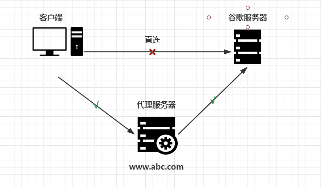
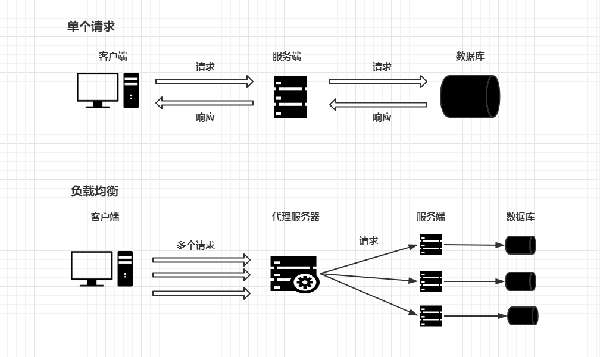
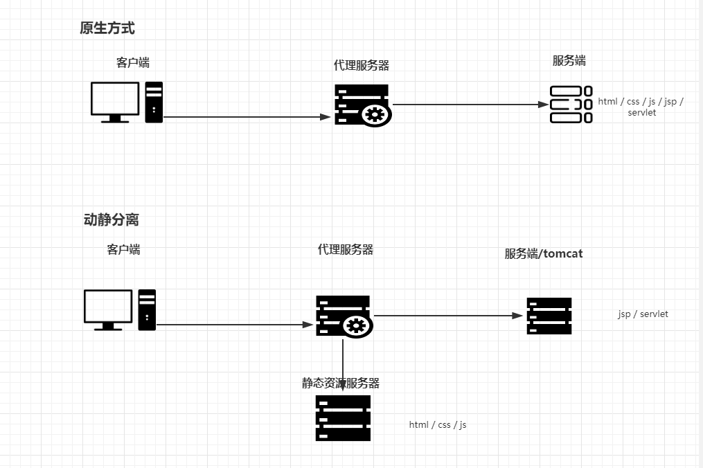

# 技术知识点

## [nginx基本概念](#nginx基本概念)
- nginx 是什么？具体做什么事情？
- 反向代理和正向代理
- 负载均衡
- 动静分离

## [nginx 安装，常用命令和配置文件](#nginx安装，常用命令和配置文件)
- 安装
- 常用命令
- 配置文件

## [nginx 配置 - 反向代理](#nginx配置-反向代理)
## 

## nginx 配置 - 负载均衡

## nginx 配置 - 动静分离

## nginx 配置 - 高可用

## nginx 原理


### nginx基本概念
- nginx 是什么？具体做什么事情？
    - 简介：
        - nginx 是一个高性能的 `http` 和 `反向代理` 服务器。
    - 特点：
        - 占用内存少，并发能力强，专为性能而开发，支持热部署。

- 反向代理和正向代理
    - 正向代理
        - 定义：
            - 如果用户直接访问谷歌服务器是访问不通的，如果想要访问到谷歌服务器需要加一台正向代理服务器，然后在客户端（浏览器）中配置代理服务器就行了。
            

    - 反向代理
        - 定义：
            - 客户端对代理服务器是无感知的，因为客户端不用任何配置就可以访问，只用将请求发送到反向代理服务器上，由反向代理服务器去选择目标服务器，获取数据后，再返回给客户端用，此时，反向代理服务器和目标服务器对外就是一台服务器，暴露的是代理服务器的地址，隐藏了真实服务器的地址。
            

- 负载均衡
    - 简介：
        - 客户端将多个请求发送到服务器，服务器处理请求，有一些可能要与数据库交互服务器处理完成后，再将结果返回给客户端。如果所有的请求都在一台服务器上访问，效率会大大的降低，这个时候就用 `负载均衡` 将多个请求通过代理服务器转发给不同的服务器上。效率会提升。
            

- 动静分离
    - 简介：
        - 为了加快网站的解析速度，可以把动态的页面和静态的页面由不同的服务器解析，加快速度，降低原来单个服务器的压力。
            

### nginx安装，常用命令和配置文件
- 安装
    - 略

- 常用命令
    ```bash
        # 查看版本号
            nginx -v
        
        # 启动nginx
            nginx -s start
        
        # 关闭nginx
            nginx -s stop
        
        # 重新加载配置文件
            nginx -s reload
    ```

- 配置文件
    - 核心配置文件的组成：
        - 全局块：
            - 从配置文件的开始到 `event` 块之间的内容，主要设置一些影响nginx服务器整体运行的配置指令，主要包括配置运行nginx的用户（组），允许生成的 work process 数，进程 pid 存放的路径，日志存放路径和类型以及配置文件引入。
        - event块：
            - 主要影响 nginx 服务器和用户的网络链接。
        - http块：
            - 配置最频繁的部分， http 块又分为 http全局块和server块。

### nginx配置-反向代理