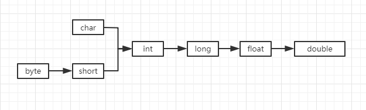

#### 数据类型

- 概要：
    - 8种基本数据类型：
        - 整型
            - byte
                - 1个字节
            - short
                - 2个字节
            - int
                - 4个字节
            - long
                - 8个字节
        - 浮点型
            - float
                - 4个字节
            - double
                - 8个字节
        - boolean
            - boolean
        - 字符型
            - char
                - 2个字节

    - 类型转换：
        - 自动类型转换：
            - 
        - 强制类型转换：
            - 强制类型转换数据容易丢失精度。

- 语法：
- 案例:
    ```java
        //类型转换-自动类型转换
            char a = 't';
            int b = a;
            System.out.println("char cover int=>" + b);

            long c = b;
            System.out.println("int cover long=>" + c);

            float d = c;
            System.out.println("long cover float=>" + d);

            double e = d;
            System.out.println("float cover double=>" + e);
    ```