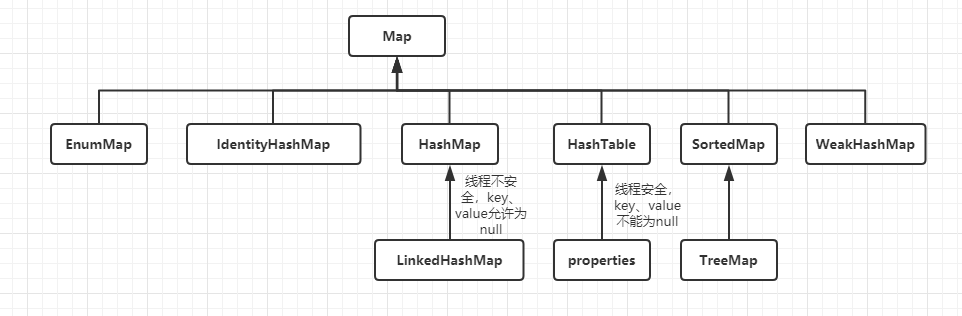

#### 容器

- 概要：
    - 数组
    - 集合：
        - 单列集合：
            - 
        - Collection
            - Set
                - HashSet
                    - 特点：
                        - 底层数据结构是哈希表。
                        - 哈希表依赖的方法：
                            - `hashCode()` 和 `equals()`
                            - 首先判断 `hashCode()` 的值是否相同，如果相同继续执行 `equals()` 方法，（看返回的结果：如果返回 `true`：不添加，返回 `false`：添加）。如果返回不同，直接存入。
                        - LinkedHashSet
                            - 特点：
                                - 底层数据结构是链表和哈希表组成。
                                - 链表保证元素有序。
                                - 哈希表保证值唯一。
                - TreeSet
                    - 特点：
                        - 底层数据结构是红黑树。
            - List(有序、可重复)
                - ArrayList
                    - 特点：
                        - 底层数据结构是数组，查询快、增删慢。
                        - 线程不安全、效率高。
                - Vector
                    - 特点：
                        - 底层数据结构是数组，查询快、增删慢。
                        - 线程安全、效率底。
                - LinkedList
                    - 特点：
                        - 底层数据结构是链表，查询慢，增删快。
        - 双列集合：
            - 
        - Map:
            - 特点：
                - map 集合的数据结构只对 `key` 值有效，和值无关。
                - 存储的是 `键值` 形式的元素，`键`唯一，`值`可重复。
            - HashMap
                - 特点：
                    - 底层数据结构是哈希表。
                    - 线程不安全、效率高。
                    - 哈希表依赖的方法：
                        -  哈希表依赖两个方法：hashCode()和equals()
                            - 执行顺序：
                                - 首先判断hashCode()值是否相同
                                    - 是：继续执行equals(),看其返回值
                                        - 是true:说明元素重复，不添加
                                        - 是：false:就直接添加到集合
                                    - 否：就直接添加到集合
                    最终：
                        自动生成hashCode()和equals()即可
                    - LinkedHashMap
                        - 特点：
                            - 底层数据结构是链表和哈希表组成。
                                - 链表保证元素的有序。
                                - 哈希表保证数据的唯一。
            - Hashtable
                - 特点：
                    - 底层数据结构是哈希表。
                    - 线程安全，效率低。
            - TreeMap
                - 特点：
                    - 底层数据结构是红黑树。
    - 循环
- 语法：
```java
    //数组：
        //语法：
            type [] arrayName;
            或者
            type arrayName [];
        //初始化：
            //静态初始化：
                //方式1
                int [] arr = new int[]{5, 6, 7, 8, 9};
                System.out.println(arr[1]);

                //方式2
                int [] arrName = {1, 2, 3, 4, 6};
            //动态初始化:
                int [] arrs = new int[5];
        //存值&获取值：
            //获取值
                arrayName[索引位置]
            //存值
                arrayName[索引位置] = 值;
    //循环
        // 1.while
            while( 布尔表达式 ) {
                //循环内容
            }

        //2.do...while...
            //循环至少执行一次
            do {
                //循环内容
            } while(条件表达式);

        //3.普通for循环
            for(初始化; 布尔表达式; 更新) {
                //执行代码块
            }

        //4.增强for
            for(声明语句 : 表达式) {
                //执行代码块
            }
        
```
- 案例：
```java
    //HashSet
        package com.tsing.extend.demo9;

        import java.util.HashSet;

        public class DemoHashSet {
            
            public static void main(String[] args) {

                HashSet<String> hs = new HashSet<String>();
                //add
                hs.add("测试1");
                hs.add("测试1");
                hs.add("测试2");
                hs.add("测试3");
                
                //delete
                hs.remove("测试2");
                
                //update
                //这个需要配合查询需要删除的元素，然后执行删除操作，最后将新的数据添加进去。
                
                //search
                for (String str : hs) {
                    System.out.println(str);
                }
            }
        }

    //TreeSet
        package com.tsing.extend.demo9;

        import java.util.TreeSet;

        public class DemoTreeSet {

            public static void main(String[] args) {
                
                TreeSet<String> ts = new TreeSet<String>();
                
                //add
                ts.add("ceshi1");
                ts.add("ceshi2");
                ts.add("ceshi3");
                ts.add("ceshi3");
                ts.add("ceshi4");
                
                //delete
                ts.remove("ceshi4");
                
                //update
                    //这个需要配合查询需要删除的元素，然后执行删除操作，最后将新的数据添加进去。
                
                //search
                for (String str : ts) {
                    System.out.println(str);
                }
                
            }

        }

    //ArrayList
        package com.tsing.extend.demo9;
        import java.util.ArrayList;

        public class DemoArrayList {
            
            public static void main(String[] args) {
                
                ArrayList<String> al = new ArrayList<String>();
                
                //add
                al.add("ceshi1");
                al.add("ceshi2");
                al.add("ceshi3");
                al.add("ceshi3");
                al.add("ceshi4");
                
                //delete
                al.remove("ceshi1");
                al.remove(2);//根据索引删除
                
                //update
                    //这个需要配合查询需要删除的元素，然后执行删除操作，最后将新的数据添加进去。
                
                //search
                for (String str : al) {
                    System.out.println(str);
                }
                
            }

        }

    //Vector
        package com.tsing.extend.demo9;

        import java.util.Vector;

        public class DemoVector {
            
            public static void main(String[] args) {
                Vector<String> v = new Vector<String>();
                
                //add
                v.add("ceshi1");
                v.add("ceshi2");
                v.add("ceshi3");
                v.add("ceshi4");
                v.add("ceshi4");
                
                //delete
                v.remove("ceshi1");
                v.remove(3);//根据索引删除数据
                
                //update
                //这个需要配合查询需要删除的元素，然后执行删除操作，最后将新的数据添加进去。
                
                //search
                
                for (String str : v) {
                    System.out.println(str);
                }
            }
        }

    //LinkedList
        package com.tsing.extend.demo9;

        import java.util.LinkedList;

        public class DemoLinkedList {
            
            public static void main(String[] args) {

                LinkedList<String> ll = new LinkedList<String>();
                
                //add
                ll.add("ceshi1");
                ll.add("ceshi2");
                ll.add("ceshi3");
                ll.add("ceshi4");
                ll.add("ceshi5");
                
                //delete
                ll.remove(0);
                ll.remove("ceshi5");
                
                //update
                ll.set(2, "测试2");
                
                //search
                for (String str : ll) {
                    System.out.println(str);
                }
            }
        }

    //HashMap
        package com.tsing.extend.demo9;

        import java.util.HashMap;
        import java.util.Map;
        import java.util.Set;

        public class DemoHashMap {
            
            public static void main(String[] args) {
                HashMap<String,String> map = new HashMap<String, String>();
                
                //add
                map.put("1", "值1");
                map.put("2", "值2");
                map.put("3", "值3");
                map.put("4", "值4"); //这个覆盖掉
                map.put("4", "值5"); 
                
                //delete
                map.remove("1");
                
                //update
                map.put("2", "修改后的值2");
                
                //search
                Set<Map.Entry<String,String>> en = map.entrySet();
                for (Map.Entry<String, String> entry : en) {
                    System.out.println("key: " + entry.getKey() + " value: " + entry.getValue());
                }
                
            }

        }

    //HashTable
        package com.tsing.extend.demo9;

        import java.util.Hashtable;
        import java.util.Map;
        import java.util.Set;

        public class DemoHashtable {
            
            public static void main(String[] args) {
                
                Hashtable<String, String> hb = new Hashtable<String, String>();
                
                //add
                hb.put("1", "值1");
                hb.put("2", "值2");
                hb.put("3", "值3");
                hb.put("4", "值4"); //这个覆盖掉
                hb.put("4", "值5"); 
                
                //delete
                hb.remove("1");
                
                //update
                hb.put("2", "修改后的值2");
                
                //search
                    Set<Map.Entry<String,String>> en = hb.entrySet();
                    for (Map.Entry<String, String> entry : en) {
                        System.out.println("key: " + entry.getKey() + " value: " + entry.getValue());
                    }
            }

        }

    //TreeMap
    package com.tsing.extend.demo9;

    import java.util.Map;
    import java.util.Set;
    import java.util.TreeMap;

    public class DemoTreeMap {
        
        public static void main(String[] args) {
            TreeMap<String, String> tm = new TreeMap<String, String>();
            
            //add
                tm.put("1", "值1");
                tm.put("2", "值2");
                tm.put("3", "值3");
                tm.put("4", "值4"); //这个覆盖掉
                tm.put("4", "值5"); 
                    
            //delete
                tm.remove("1");
                    
            //update
                tm.put("2", "修改后的值2");
                    
            //search
                Set<Map.Entry<String,String>> en = tm.entrySet();
                    for (Map.Entry<String, String> entry : en) {
                        System.out.println("key: " + entry.getKey() + " value: " + entry.getValue());
                    } 
        }
    }

    //循环
        //1.while
            public static void main (String[] args) {
                int x = 10;
                while(x < 20) {
                    System.out.print("value of x : " + x );
                        x++;
                    System.out.print("\n");
                }
            }
        //2.do...while...
            public static void main (String[] args) {
                int x = 10;
                do{
                    System.out.print("value of x : " + x );
                        x++;
                    System.out.print("\n");
                } while (x < 12);
            }

        //3.for
            public static void main (String[] args) {
                for(int i = 0; i <= 10; i++){
                    System.out.println("执行了第" + i + "次");
                }
            }

        //4.增强for
            public static void main (String[] args) {
                String[] names = { "李栋", "王彦舒", "老子恨你" };
                for( String name : names ) {
                    System.out.println(name);
                };
            }
```
