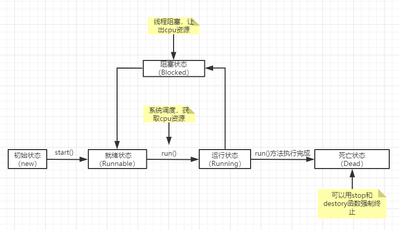

#### 线程

- 概要：
    - 定义：
        - 软件或者硬件上实现多个线程并发执行的技术。
    - 简介：
        - 线程（Thred）：
            - 一个进程中可以有多个线程，如看视频的同时可以听声音，看图像，看弹幕等等。。。
        - 进程（Process）：
            - 操作系统中运行的程序就是进程，比如QQ、播放器、游戏、IDE等等。。。
        - 多线程
    - 线程创建：
        - Thread
        - Runnable
        - Callable
    - 线程的五大状态：
        - 分类：
            - 创建状态
            - 就绪状态
            - 阻塞状态
            - 死亡状态
            - 运行状态
        - 线程五种状态之间的状态：
            - 
    - 线程的方法：
        - 停止线程
        - 休眠线程
        - 礼让线程
        - 合并线程
    - 线程优先级：
    - 守护进程：
    - 线程同步：
    - 同步方法：
        - synchronized
    - 死锁：
    - Lock锁：
    - 生产者和消费者：
        - 解决方式：
            - 利用缓冲去解决：管道法
            - 信号灯法：标志位
    - 线程池：
- 语法：
- 案例：
```java
    //线程创建：
        //Thread
            package com.tsing.thread;

            //继承 Thread,重写run方法，调用start开启线程
            //注意：线程开启不一定立即执行，由cpu调度执行。
            public class ThreadDemo extends Thread{

                @Override
                public void run() {
                    for (int i = 0; i < 10; i++) {
                        System.out.println("run=> " +  i);
                    }
                }

                public static void main(String[] args) {

                    ThreadDemo td = new ThreadDemo();
                    td.start();

                    //main 方法执行
                    for (int i = 0; i < 20; i++) {
                        System.out.println("main=> " + i);
                    }
                }
            }

        //Runnable
            package com.tsing.thread;
            //实现 Runnable,重写run方法,执行线程需要丢入runnable接口实现类，调用start方法。
            public class RunnableDemo implements Runnable{

                @Override
                public void run() {
                    for (int i = 0; i < 10; i++) {
                        System.out.println("run=> " + i);
                    }
                }

                public static void main(String[] args) {

                    RunnableDemo rd = new RunnableDemo();
                    new Thread(rd).start();
                    
                    for (int i = 0; i < 20; i++) {
                        System.out.println("main=>" + i);
                    }
                }
            }

        //Ruuable
            package com.tsing.thread;

            //多个线程同时操作一个对象
            public class RunnableDemo02 implements Runnable{

                private int tickNum = 10;

                @Override
                public void run() {
                    while (true){
                        if(tickNum<=0){
                            break;
                        }
                        try {
                            Thread.sleep(200);
                        } catch (InterruptedException e) {
                            e.printStackTrace();
                        }
                        System.out.println(Thread.currentThread().getName() + "=》获取到第" + tickNum-- + "火车票");
                    }
                }

                public static void main(String[] args) {
                    RunnableDemo02 r = new RunnableDemo02();

                    new Thread(r, "小明").start();
                    new Thread(r,"青衣").start();
                    new Thread(r,"靓仔").start();
                }
            }

        //Callable
            package com.tsing.thread;

            import java.util.concurrent.*;

            //实现 Callable，重写call方法
            public class CallableDemo implements Callable<Boolean> {

                @Override
                public Boolean call() throws Exception {
                    for (int i = 0; i < 100; i++) {
                        System.out.println(Thread.currentThread().getName() + "run=>" + i);
                    }
                    return true;
                }

                public static void main(String[] args) throws ExecutionException, InterruptedException {
                    CallableDemo cd1 = new CallableDemo();
                    CallableDemo cd2 = new CallableDemo();
                    CallableDemo cd3 = new CallableDemo();

                    ExecutorService es = Executors.newFixedThreadPool(3);

                    Future<Boolean> r1 = es.submit(cd1);
                    Future<Boolean> r2 = es.submit(cd2);
                    Future<Boolean> r3 = es.submit(cd3);

                    Boolean b1 = r1.get();
                    Boolean b2 = r2.get();
                    Boolean b3 = r3.get();

                    es.shutdown();
                }

            }
    
    //线程的方法
        //线程停止
            package com.tsing.thread;

            //测试stop
            //建议使用标志位
            public class StopDemo implements Runnable{

                private boolean flag = true;

                @Override
                public void run() {
                    int i = 0;
                    while (flag){
                        System.out.println("run=>" + i++);
                    }
                }

                public void stop(){
                    this.flag = false;
                }

                public static void main(String[] args) {
                    StopDemo sd = new StopDemo();
                    new Thread(sd).start();

                    for (int i = 0; i < 1000; i++) {
                        System.out.println("main=> " + i);
                        if(i == 900){
                            sd.stop();
                            System.out.println("线程停止了");
                        }
                    }
                }
            }

        //线程休眠
            package com.tsing.thread;

            public class SleepDemo {

                public static void main(String[] args) throws InterruptedException {
                    tenDown();
                }

                public static void tenDown() throws InterruptedException {
                    int num = 10;
                    while (true){
                        Thread.sleep(100);
                        System.out.println("倒计时=》" + num--);
                        if(num<=0){
                            break;
                        }
                    }
                }
            }

        //线程礼让
            package com.tsing.thread;

            //测试礼让线程
            // 礼让不一定成功，看cpu心情
            public class YieldDemo implements Runnable{
                @Override
                public void run() {
                    System.out.println(Thread.currentThread().getName() + "=> 线程开始执行！！！！");
                    Thread.yield();
                    System.out.println(Thread.currentThread().getName() + "=> 线程停止执行！！！！");
                }
            }

            class TestYield{
                public static void main(String[] args) {
                    YieldDemo yd = new YieldDemo();
                    new Thread(yd, "a").start();
                    new Thread(yd, "b").start();
                }
            }

        //合并线程
            package com.tsing.thread;

            //测试线程插队现象
            public class JoinDemo implements Runnable{

                @Override
                public void run() {
                    for (int i = 0; i < 100; i++) {
                        System.out.println("VIP 线程执行run=>>" + i);
                    }
                }

                public static void main(String[] args) throws InterruptedException {
                    JoinDemo jd = new JoinDemo();
                    Thread thread = new Thread(jd);
                    thread.start();

                    for (int i = 0; i < 1000; i++) {
                        if(i == 200){
                            thread.join();
                        }
                        System.out.println("main=>");
                    }
                }
            }
    //线程池
        package com.tsing.thread;

        import java.util.concurrent.ExecutorService;
        import java.util.concurrent.Executors;

        //线程池
        public class PoolDemo {
            public static void main(String[] args) throws InterruptedException {
                //创建线程池
                ExecutorService executorService = Executors.newFixedThreadPool(10);

                //执行
                executorService.execute(new MyThread());
                Thread.sleep(1000);
                executorService.execute(new MyThread());
                executorService.execute(new MyThread());
                executorService.execute(new MyThread());
                executorService.execute(new MyThread());

                //关闭链接
                executorService.shutdown();
            }
        }

        class MyThread implements Runnable {

            @Override
            public void run() {
                for (int i = 0; i < 10; i++) {
                    System.out.println(Thread.currentThread().getName() + i);
                }
            }
        }
```
