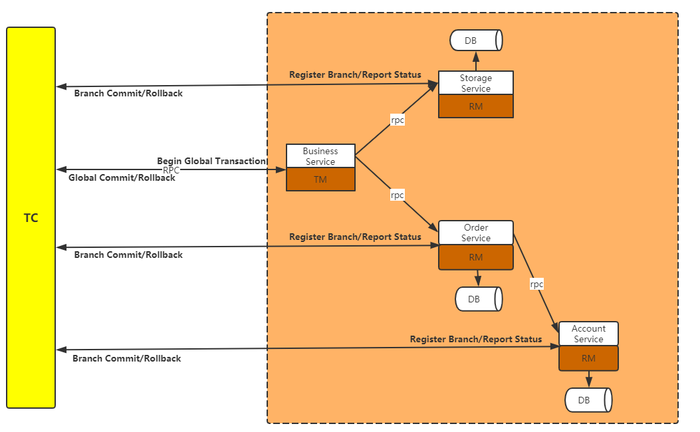

#### 方案
##### 项目中架构图以及Seata提供的解决方案
- 说明：
    - 用户购买商品的业务逻辑，整个业务逻辑由三个微服务支持：
        - 仓储服务（Storage）：对应的式具体的商品的数量。
        - 订单服务（Order）：根据采购创建订单。
        - 账户服务（Account/User）：用户信息和用户账户信息。
- 图例：
    - 
