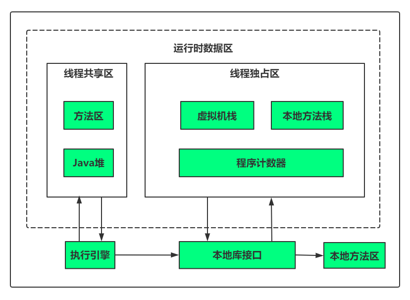

#### JVM内存模型

##### 内存模型简介：

- 方法区：
    - 存储运行时常量池，已被虚拟机加载的类信息，常量，静态变量，即时编译器编译后的代码等数据。
- java堆：
    - 存储对象实例。
- 虚拟机栈：
    - 存放方法运行时所需的数据，成为栈帧。
- 本地方法栈：
    - 为JVM所调用的Native，即本地方法服务。
- 程序计数器：
    - 记录当前线程所执行到的字节码的行号。

##### 本地方法栈详解：
- 虚拟机栈为虚拟机执行的java方法服务。
- 本地方法栈为虚拟机执行的Native方法服务。

##### 程序计数器详解：
- 程序计数器是一块比较小的内存空间，它可以看作是当前线程所执行的字节码的行号指示器。
- 程序计数器处于线程独占区。
- 如果线程执行的是JAVA方法，这个计数器记录的是正在执行的虚拟机字节码指令的地址。如果正在执行的是Native方法，这个计数器的值为undefined。
- 此区域是唯一一个在java虚拟机规范中没有规定任何OutOfMemoryError情况的区域。

##### 方法区（元空间）以及常量池详解：
- 方法区（元空间）：
    - 存储虚拟机加载的类信息，常量，静态变量，即时编译器编译后的代码等数据。
    - 方法区和永久代。
    - 垃圾回收再方法区的行为。
    - 异常的定义。
- 常量池：
    - 属于方法区的空间。 

##### 线程栈以及栈帧内部结构详解：

##### 堆内存分代机制和对象生命周期：
