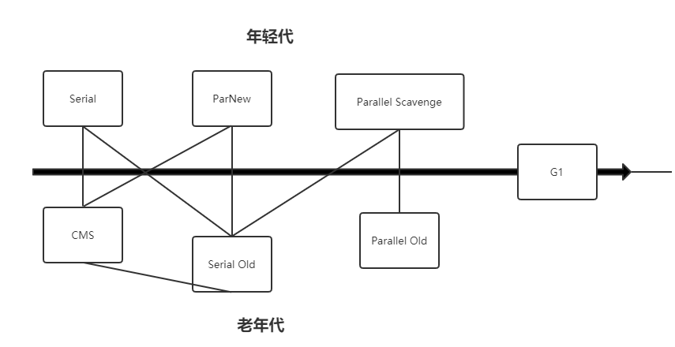
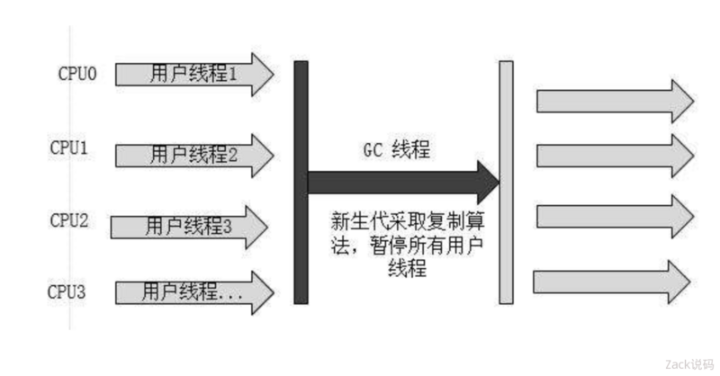
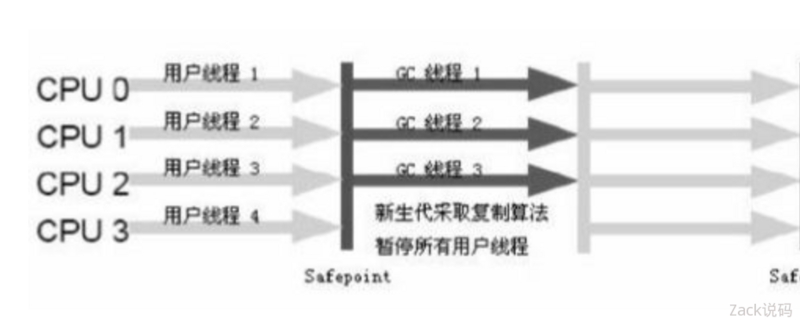
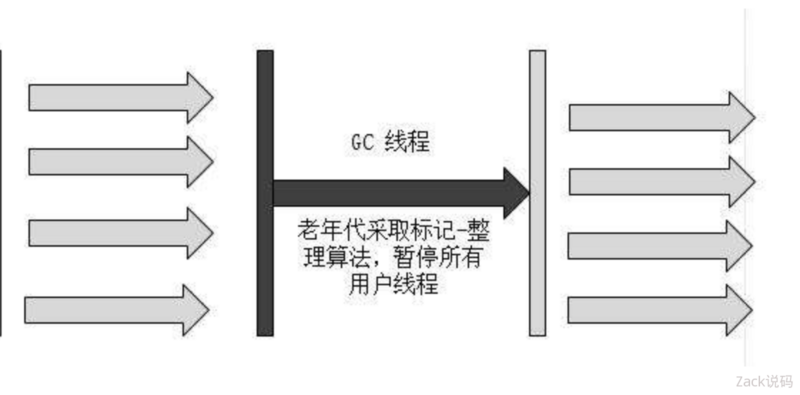
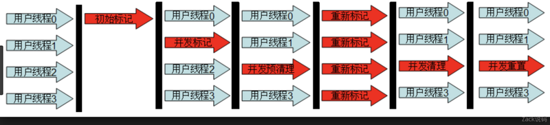
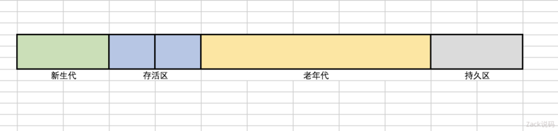
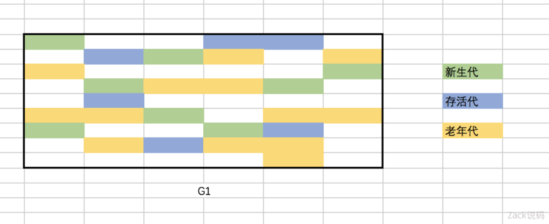
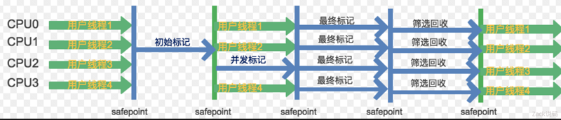

#### 垃圾收集机制

##### 查看不同的收集器在年轻代和老年代适用范围

##### 新生代
- Serial
    - 
    - Serial，是单线程执行垃圾回收的。当需要执行垃圾回收时，程序会暂停一切手上的工作，然后单线程执行垃圾回收。因为新生代的特点是对象存活率低，所以收集算法用的是复制算法，把新生代存活对象复制到老年代，复制的内容不多，性能较好。
    - 单线程的好处就是减少上下文切换，减少系统资源的开销。但这种方式的缺点也很明显，在GC的过程中，会暂停程序的的执行，若GC不是频繁发生，还是比较好的，否则将会影响程序的执行性能。对于新生代来说，区域比较小，停顿时间短，所以比较适用。

- ParNew
    - 
    - ParNew 同样是用于新生代，但是它是多线程版本，并且在参数、算法（也是复制算法）上完全和Serial相同。
    - 它的并行仅仅指的是收集多线程并行，并不是收集和原程序可以并行进行。它也是需要暂停程序的一切工作，然后多线程执行垃圾回收。
    - 因为是多线程执行，所以在多CPU下，它的效果要比Serial好，但是如果是单CPU则会因为线程的切换，性能反而更差。

- Paralle Scavenge
    - 新生代的收集器，同样用的复制算法，也是并行多线程收集。与ParNew最大的不同，它关注的是垃圾回收的吞吐量。
    - 这里的吞吐量指的是总时间与垃圾回收时间的比例。这个比例越高，证明垃圾回收占整个程序运行的比例越小。
    - Paralle Scavenge收集器提供两个参数控制垃圾回收的执行：
        - `-XX:MaxGCPauseMillis`,最大垃圾回收停顿时间，这个参数的原理是空间换时间，收集器会控制新生代的区域大小，从而尽可能保证回收少于这个最大停顿时间。简单的说就是回收的区域越小，耗费的时间也越小。`所以这个参数不是设置的越小越好，设太小的话，新生代空间会太小，从而更频繁的出发GC。`
        - `-XX:GCTimeRatio`,垃圾回收的时间和总时间占比。这个是吞吐量的倒数，原理和MaxGCPauseMillis相同。
    - 因为它关注的是收集器的吞吐量，所以当设置好以上的参数，同时不想设置各个区域的大小，可以开启`-XX:UseAdptiveSizePolicy`参数，让JVM监控收集的性能，动态调整这些区域的大小参数。

##### 老年代
- Paralle Old
    - 
    - 老年代的收集器，是Paralle Scavenge老年代的版本。就是算法由`复制算法`变成了`标记-整理`。
- CMS
    - 
    - 同样是老年代的收集器。他关注的是垃圾回收最短的停顿时间，在老年代并不频繁GC的场景下，是比较适用的。
    - 工作原理：
        - `初始标记`，单线程执行，需要`Stop The World`,但仅仅把GC Roots的直接关联可达的对象给标记一下，由于直接关联对象比较小，所以这里的速度非常快。
        - `并发标记`，对于初始标记的过程所标记的初始标记对象，进行并发追踪标记，此时其他线程依然可以继续工作。此处的时间长，但是不会停顿。
        - `重新标记`，在并发标记的过程中，由于可能还会产生新的垃圾，所以此时需要重新标记新产生的垃圾。此处执行并标记，和用户线程并不并发，所以依然是`Stop The World`，时间比初始时间要长一点。
        - `并发清除`，并发清除之前所有标记的垃圾，其他用户线程还可以工作，不需要停顿。
    - 由于最耗费的时间并发标记和并发清除阶段不需要暂停工作，所以整体的回收时低停顿的。
    - 由于CMS的特性，缺点也是比较明显的：
        - Mark Sweep算法会导致内存碎片比较多。
        - CMS的并发能力依赖于CPU资源，所以在CPU数量少和CPU资源紧张的情况，性能比较差。
        - 并发清除阶段，用户线程依然在运行，所以依然会产生新的垃圾，此阶段的垃圾并不会再本次GC中回收，而是放到下次，所以GC不能等待内存耗尽的时候才进行GC，这样的话会导致清除并清除的时候，用户线程可以利用空间的不足，所以这里会浪费一些内存空间给用户线程预留。
- Serial Old
    - 
    - 老年代的收集器，和Serial一样是单线程，不同的是算法用的是`标记-整理`。
    - 因为老年代里面对象的存活率高，如果依旧用的复制算法，需要复制的内容较多，性能较差。并且在极端的情况下，当存活为100%时，没有办法用复制算法。所以需要用`标记-整理`，以有效的避免这些问题。
##### 中间
- G1
    - G1全称 Garbage First,在JDK1.7版本正式启用，是当前最前沿的垃圾收集器。G1可以说是CMS的最终改进版，G1可以说是CMS的最终改进版，解决了CMS内存碎片，更多的内存空间问题。虽然流程和CMS相似，但是底层的原理已是完全不同。
    - `高效率优先`，G1会预测垃圾会受到额停顿时间，原理是计算老年代对象的效益率，优先回收最大效益的对象。 
    - `堆内存结构的不同`以前的收集器分别是划分`新生代、老年代、持久代等。`
        - 
    - G1则是把内存分为大小相同的区域Region，每个Region拥有各自的分代属性，单这些分代不需要连续。
        - 
    - 这样的分区可以有效的避免内存碎片化问题。
    - 但是这样就会有一个新的问题，就是分代内存的不连续，导致在GC搜索垃圾对象的时候需要全表盘扫描找出引用的内存所在。
    - 为了这个问题，G1对于Region都维护一个Remembered Set，用于记录对象引用的情况。当GC发生的时候根据Remembered Set的引用情况去搜索。
    - 两种GC模式：
        - Young GC,关注所有年轻代的Region,通过控制收集年轻代的Region个数，从而控制GC的回收时间。
        - Mixed GC,关注所有年轻代的Region，并且加上预测计算最大收益的若干个老年代Region。
    - 执行流程：
        - `初始标记`，标记了从GC Root开始直接关联可达对象，`Stop The World`执行。
        - `并发标记`，并发标记初始标记的对象，此时用户线程依然可以执行。
        - `最终标记`，`Stop The World`标记并发标记过程中产生的垃圾。
        - `筛选回收`，评估标记垃圾，根据GC模式回收垃圾，`Stop The World`执行。
        - 
- ZGC