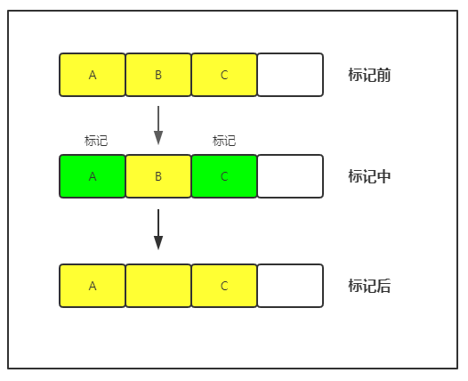
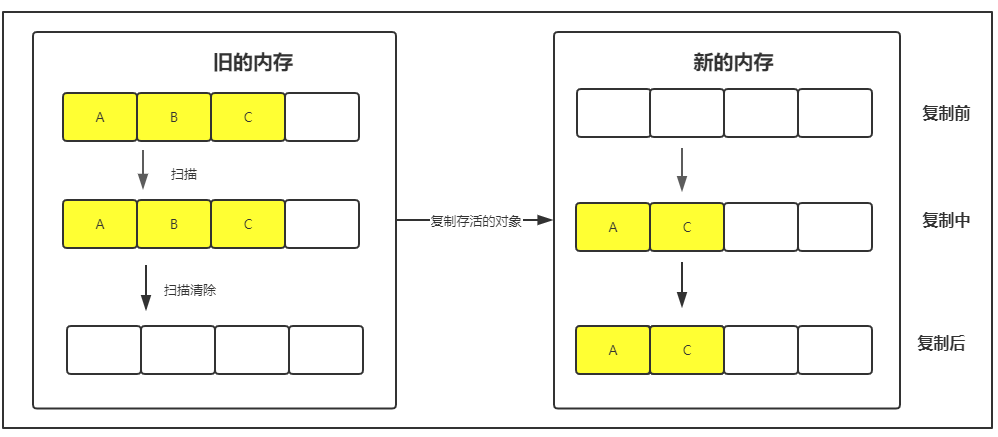
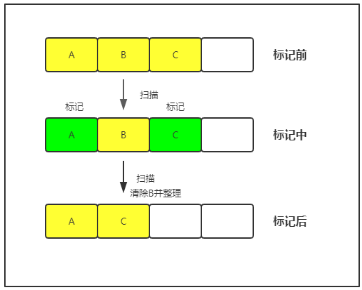
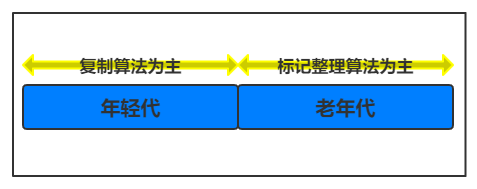

#### 垃圾收集算法

##### 垃圾对象判断的标准
- 引用计数法
    - Java在运行时，当有一个地方引用对象实例，会将这个对象实例加1，引用失效就减1，在jvm扫描内存时，发现引用计数值为0的则是垃圾对象，计数值大于0的则为活跃对象。
    - 目前垃圾回收算法，没有采用引用计数算法，原因是在对象互相引用的情况下，无法判断两者是否为垃圾对象。
- 根搜索法
    - 根搜索算法是以`GC ROOTS`为起始点往下搜索，所有经过的对象合并起来称为引用链，在这引用链里，没有引用的对象称为垃圾对象，（实际上jvm还做了一个筛选动作，判断当前对象是否执行finalize()方法，如果不需要执行才判定为垃圾对象），在引用链里的是活跃对象，那什么样的对象才能称为`GC ROOTS`呢？以下四种可以：
        - 虚拟机栈（栈帧的本地变量表）中引用的对象。
        - 方法区中的类静态属性的引用的对象。
        - 方法区中的常量引用的对象。
        - 本地方法栈中JNI(Native方法)的引用对象。

##### 垃圾回收的算法
- 标记-清除（Mark-Sweep）
    - jvm会扫描所有的对象实例，通过根搜索算法，将活跃对象进行标记，jvm再一次扫描所有对象，将未标记的对象进行清除，只有清除动作，不作任何的处理，这样导致的结果会存在很多内存碎片。
    - 

- 复制（copying）
    - jvm扫描所有对象，通过根搜索标记被引用的对象，之后会申请新的内存空间，将标记的对象复制到新的内存空间里，存活的对象复制完，会清空原来的内存空间，将新的内存空间存储新的对象。这样虽然解决了内存碎片问题，但是如果对象很多，重新申请新的内存空间会很大，在内存不足的场景下，会对jvm运行造成很大的影响。
    - 

- 标记-整理（Mark-compact）
    - 标记整理实际上在标记清除算法的优化，执行完成标记清除全过程之后，再一次对内存进行整理，将所有存活的对象统一向一端移动，这样解决了内存碎片的问题。
    - 

- 分代回收
    - 目前jvm常用回收算法就是分代回收，年轻代以复制算法为主，老年代以标记整理算法为主。原因是年轻代对象比较多，每次垃圾回收都有很多的垃圾对象回收，而且要尽可能快的减少生命周期短的对象，存活的对象较少，这个时候复制算法比较适合，只要将有标记的对象复制到另一个内存区域，其余全部清除，并且复制的数量较少，效率较高，而老年代是年轻代筛选出来的对象，被标记比较高，需要删除的对象比较少，显然采用标记整理效率较高。
    - 
