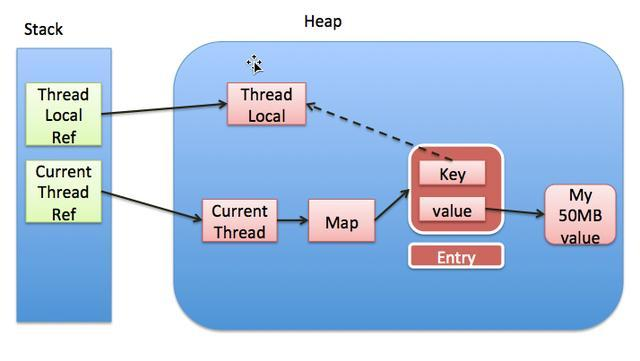

#### ThreadLocal

##### 说明：
JDK文档中这样解释`ThreadLocal`的：`该类提供了线程局部 (thread-local) 变量。这些变量不同于它们的普通对应物，因为访问某个变量（通过其 get 或 set 方法）的每个线程都有自己的局部变量，它独立于变量的初始化副本。ThreadLocal 实例通常是类中的 private static 字段，它们希望将状态与某一个线程（例如，用户 ID 或事务 ID）相关联。`。

##### 所属包：
```java
java.lang包下的类
```

##### 案例：
在文档中JDK提供了Demo:
```java
import java.util.concurrent.atomic.AtomicInteger;

public class UniqueThreadIdGenerator {
    private static final AtomicInteger uniqueId = new AtomicInteger(0);
    private static final ThreadLocal <Integer> uniqueNum = 
         new ThreadLocal<Integer>() {
             @Override protected Integer initialValue() {
                 return uniqueId.getAndIncrement();
        }
    };
 
    public static int getCurrentThreadId() {
        return uniqueId.get();
    }
}
```

##### 多线程下的`ThreadLocal`？


##### 查看源码
- set
  ```java
    public void set(T value) {
        //获取当前线程
        Thread t = Thread.currentThread();
        //会调用下面的方法
        ThreadLocalMap map = getMap(t);
        if (map != null)
            map.set(this, value);
        else
            createMap(t, value);
    }

    ThreadLocalMap getMap(Thread t) {
        return t.threadLocals;
    }
    
    //ThreadLocalMap是什么呢？
    /**
      说明：他其实就是ThreadLocalMap中的一个静态内部类，里面定义了Entry保存数据。
      TODO://这个地方重新确认一下
    */
     static class Entry extends WeakReference<ThreadLocal<?>> {
            /** The value associated with this ThreadLocal. */
            Object value;

            Entry(ThreadLocal<?> k, Object v) {
                super(k);
                value = v;
            }
      }
  ```

- get
  ```java
      public T get() {
        Thread t = Thread.currentThread();
        ThreadLocalMap map = getMap(t);
        if (map != null) {
            ThreadLocalMap.Entry e = map.getEntry(this);
            if (e != null) {
                @SuppressWarnings("unchecked")
                T result = (T)e.value;
                return result;
            }
        }
        return setInitialValue();
    }
    
    private T setInitialValue() {
        T value = initialValue();
        Thread t = Thread.currentThread();
        ThreadLocalMap map = getMap(t);
        if (map != null)
            map.set(this, value);
        else
            createMap(t, value);
        return value;
    }
  ```
- remmove
  ```java
     public void remove() {
         ThreadLocalMap m = getMap(Thread.currentThread());
         if (m != null)
             m.remove(this);
     }
  ```

##### 注意事项：
- 内存泄漏：

- 说明：
> 1、Thread中有一个ThreadLocalMap,在set()或者get()的时候都会获取ThreadLocalMap。  
> 2、ThreadLocalMap的key就是当前的ThreadLocal，值是我们自己设置的。  
> 3、ThreadLocal是一个弱引用，当key被置为null时，会被垃圾回收，但是值得引用还在，所以每次操作完ThreadLocal之后，进行remove()。
