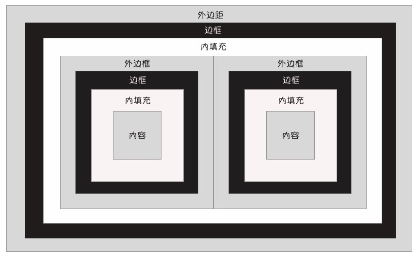

# 盒模型和 display
- 概要：
    - 一、盒模型的父子的组合方式：
        
    - 二、两种基本的盒模型：
        - block
        - inline
    - 三、none值和visibility属性
    - 四、inline-block类型的盒模型
    - 五、inline-table类型的盒模型
    - 六、使用table类型的盒模型实现表格
        - table
        - table-caption
        - table-cell
        - table-column
        - table-column-group
        - table-hearder-group
        - table-footer-group
        - table-row
        - table-row-group
    - 七、list-item类型的盒模型
    - 八、run-in类型的盒模型      
- 语法：
    ```css
        /*
            二、两种基本的盒模型：
                这种盒模型的元素默认占据一行，允许通过css设置宽度、高度。例如：块级元素。
                    - block
                这种盒模型的元素不会占据一行（默认允许在一行设置多个元素），即使通过 css 设置高度、宽度也不会起作用。例如：行内元素。
                    - inline

            三、none值和visibility属性
                设置目标对象隐藏，一旦对象隐藏，其占用的页面空间会释放。
                    - none
                设置目标对象是否显示，隐藏某个html以后，该元素占用的页面空间依然会被保留。
                    - visibility

            四、inline-block类型的盒模型
                通过 display 属性设置 inline-block 就能实现盒模型，这种盒模型是 inline 类型和 block 类型的综合体：inline-block 类型的盒模型的元素既不会占据一行，同时支持设置高度和宽度。
                    - inline-block
            
            五、inline-table类型的盒模型
                默认情况下，<table/> 元素属于块类型的元素，默认占据一行，他的左边不允许出现任何内容，右边也不允许出现任何内容，通过 width 和 height 设置宽和高。
                css 为 <table/> 元素提供了一个 inline-table 类型的盒模型，这个盒模型允许表格通过
                width 和 height 设置宽度和高度，而且允许他的左边和右边出现其他内容。
                通过 vertical-align 属性来实现控制内容区域的位置。
                    - inline-table
            
            六、使用table类型的盒模型实现表格
                    - table
                    - table-caption
                    - table-cell
                    - table-column
                    - table-column-group
                    - table-hearder-group
                    - table-footer-group
                    - table-row
                    - table-row-group
            
            七、list-item类型的盒模型
                    - 
        */
    ```
- 案例：