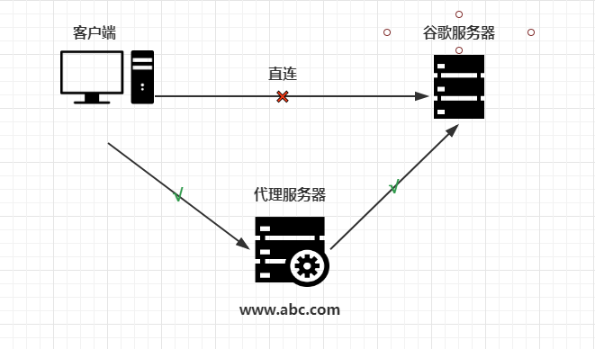
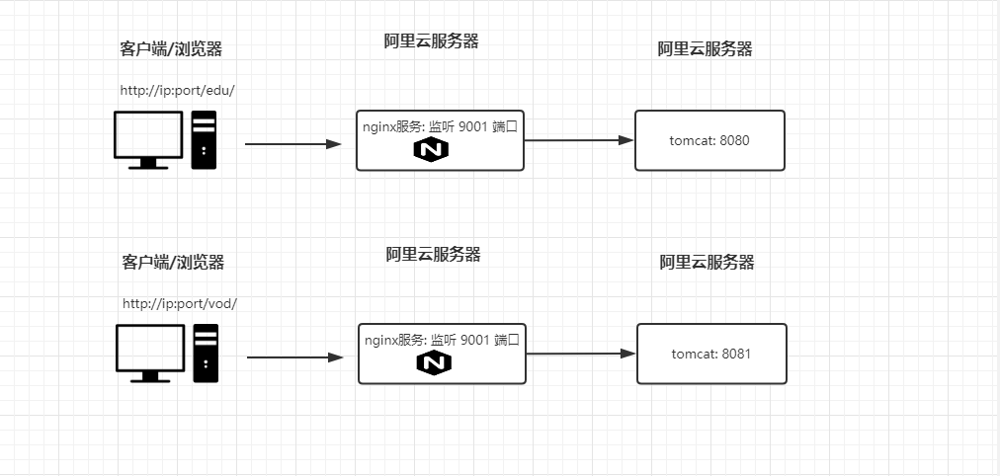

# TODO:
- nginx 原理
- 动静分离
- 高可用

# 技术知识点

## [nginx基本概念](#nginx基本概念)
- nginx 是什么？具体做什么事情？
- 反向代理和正向代理
- 负载均衡
- 动静分离

## [nginx 安装，常用命令和配置文件](#nginx安装，常用命令和配置文件)
- 安装
- 常用命令
- 配置文件

## [nginx配置](#nginx配置)
- 反向代理
- 负载均衡
- 动静分离
- 高可用

### nginx基本概念
- nginx 是什么？具体做什么事情？
    - 简介：
        - nginx 是一个高性能的 `http` 和 `反向代理` 服务器。
    - 特点：
        - 占用内存少，并发能力强，专为性能而开发，支持热部署。

- 反向代理和正向代理
    - 正向代理
        - 定义：
            - 如果用户直接访问谷歌服务器是访问不通的，如果想要访问到谷歌服务器需要加一台正向代理服务器，然后在客户端（浏览器）中配置代理服务器就行了。
            

    - 反向代理
        - 定义：
            - 客户端对代理服务器是无感知的，因为客户端不用任何配置就可以访问，只用将请求发送到反向代理服务器上，由反向代理服务器去选择目标服务器，获取数据后，再返回给客户端用，此时，反向代理服务器和目标服务器对外就是一台服务器，暴露的是代理服务器的地址，隐藏了真实服务器的地址。
            

- 负载均衡
    - 简介：
        - 客户端将多个请求发送到服务器，服务器处理请求，有一些可能要与数据库交互服务器处理完成后，再将结果返回给客户端。如果所有的请求都在一台服务器上访问，效率会大大的降低，这个时候就用 `负载均衡` 将多个请求通过代理服务器转发给不同的服务器上。效率会提升。
            

- 动静分离
    - 简介：
        - 为了加快网站的解析速度，可以把动态的页面和静态的页面由不同的服务器解析，加快速度，降低原来单个服务器的压力。
            

### nginx安装，常用命令和配置文件
- 安装
    - 略

- 常用命令
    ```bash
        # 查看版本号
            nginx -v
        
        # 启动nginx
            nginx -s start
        
        # 关闭nginx
            nginx -s stop
        
        # 重新加载配置文件
            nginx -s reload
    ```

- 配置文件
    - 核心配置文件的组成：
        - 全局块：
            - 从配置文件的开始到 `event` 块之间的内容，主要设置一些影响nginx服务器整体运行的配置指令，主要包括配置运行nginx的用户（组），允许生成的 work process 数，进程 pid 存放的路径，日志存放路径和类型以及配置文件引入。
        - event块：
            - 主要影响 nginx 服务器和用户的网络链接。
        - http块：
            - 配置最频繁的部分， http 块又分为 http全局块和server块。

### nginx配置
- 反向代理
    - 业务场景-1：
        - 在浏览器的地址栏中输入一个网址 `www.123.com` 跳转到 `tomcat` 主页中。
    
    - 访问过程:
        
    
    - 配置 `nginx.conf` 文件 :
        ```bash
            ...
                server_name www.123.com;
                location / {
                    proxy_pass http://127.0.0.1:8080;
                };
            ...
        ```

    - 业务场景-2:
        - 使用 `nginx` 反向代理，根据访问路径跳转不同的服务中去。
    
    - 访问过程:
        。
    
    - 配置 `nginx.conf` 文件：
        ```bash
            ...
                server{ 
                    listen 9001;
                    server_name location;
                    
                    location ~ /edu/ {
                        proxy_pass http://127.0.0.1:8080;
                    }

                    location ~ /vod/ {
                        proxy_pass http://127.0.0.1:8081;
                    }
                }
            ...
        ```
        
- 负载均衡
    - 负载均衡的分配策略:
        - 轮询(默认)
        - weight: 权重
        - ip_hash: 每个用户的访问固定ip
        - fair(第三方工具)：按照后端响应时间，响应时间端的优先分配。
    - 业务场景:
        - 在浏览器地址中输入 `http://ip/edu/a.html`， 负载均衡会将请求平均的分配到 `8080` 和 `8081` 服务中。

    - 配置 `nginx.conf` 文件：
        - 在 `http` 块下添加：
            ```bash
                ...
                    upstream myserver {
                        server ip：port;
                        server ip1: port;
                    }
                ...
            ```

        - 在 `server` 中:
            ```bash
                server {
                    listen 80;
                    server_name ip; # 从上随便找一个 ip
                    location / {
                        proxy_pass http://myserver;
                    }
                }
            ```

- 动静分离
    - 略

- 高可用
    - 略