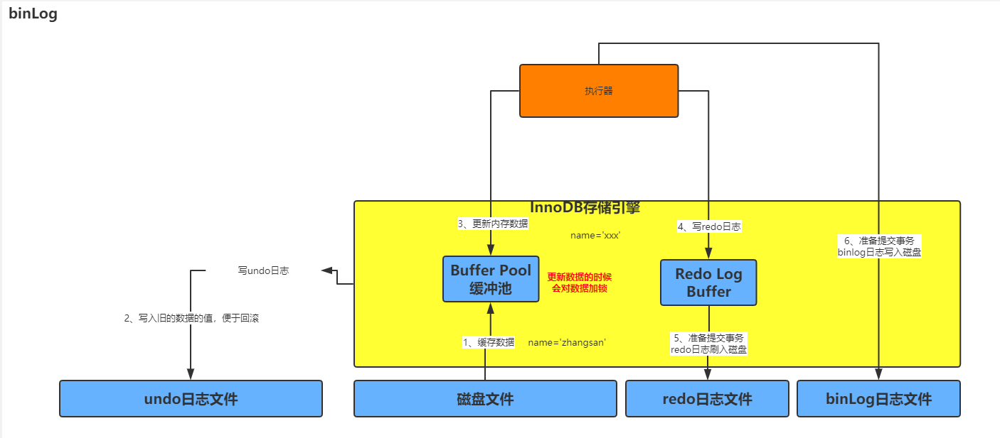
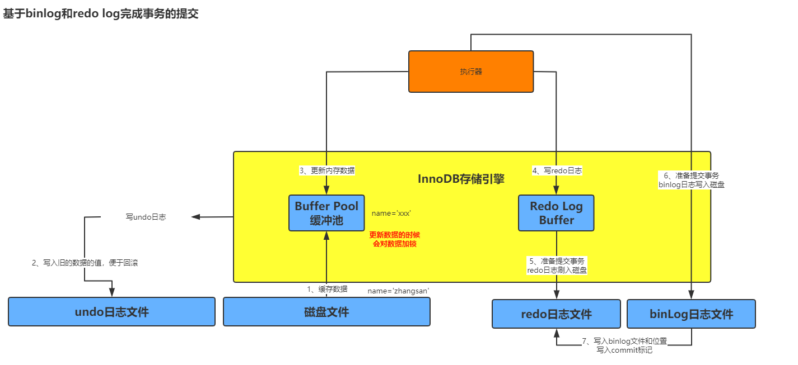
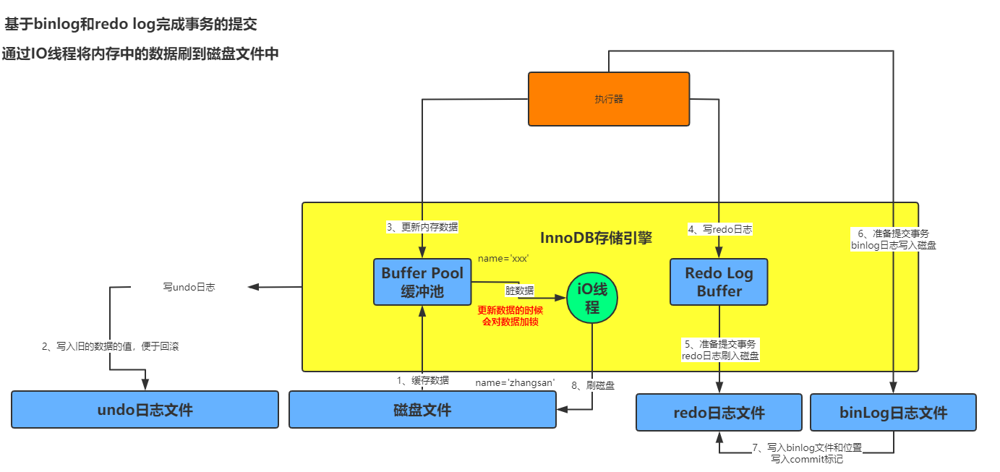

#### binlog
- 概要：
    - 简介：
        - redo log 是一种偏向物理性质的重做日志，因为他里面记录类似的这样的东西，“对那个数据也中的什么记录，做了个什么修改”。
        - redo log是InnoDb中存储引擎特有的一个东西。
        - binlog叫做归档日志，他里面记录的是面向偏于逻辑性的日志，类似与“对users表中的id=10的一行数据做了更新操作，更新以后的值是什么”。
        - binlog不是InnoDB存储引擎特有的日志文件，是属于mysql server 自己的日志文件。
    - 提交事务的时候，同时会写入binlog:
        - 当事务提交的时候，redo log日志会写入磁盘文件中。其实在提交事务的时候，我们同时还会把这次更新对应的binlog日志写入磁盘的文件中。
        - 图例：
            - 
    - binlog日志刷盘策略：
        - 说明：
            - 通过 `sync_binlog` 参数可以控制binlog的刷盘策略。
        - 分类：
            - 参数0：
                - 默认值是 0，当binlog写入磁盘的时候，其实不是直接进入磁盘文件，而是进入 os cache 内存缓存。但是如果此时服务器宕机，存在os cache里的binlog日志是会丢失的。
            - 参数1：
                - 强制在提交事务的时候，binlog直接写入磁盘文件中，那么这样提交事务之后，哪怕机器宕机，磁盘上的binlog是不会丢失的。
    - 基于binlog和redo log完成事务的提交：
        - 图例：
            - 
        - 说明：
            - 当我们把binlog写入磁盘文件后，接着就会完成最终事务的提交，此时会把本次更新对应的binlog文件名和这次binlog日志在文件里的位置，都写入到redo log文件中，同时在redo log日志文件里写入一个commit标记。在完成这件事情之后，才算最终完成了事务的提交。
            - 写入commit标记的意义是保持，redo log 和 binlog 日志保持一致的。
    - 后台io线程随机将内存更新后的脏数据刷回磁盘：
        - 图例：
            - 
        - 说明：
            - 当上面的步骤执行完成之后，最后会有一个线程去随机的把buffer pool的修改后的数据刷回到磁盘中。即使mysql服务宕机也没有关系，因为所有修改后的数据都在redo log中了。
- 语法：
- 案例：
