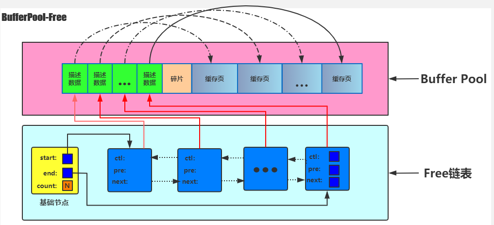

#### bufferpool中的free链表

- 概要：
    - 定义：
        - 当启动MySQL服务器的时候，需要初始化`Buffer Pool`内存空间。把他划分成若干对`描述文件`和`缓存页`。此时并没有真实的数据页被缓存到`Buffer Pool`中，因为还没有用到，之后随着程序的运行，会不断的有数据页被缓存到`Buffer Pool`中。
        - 因为刚刚完成初始化的`Buffer Pool`中所有的缓存页都是空的，所以每一个数据页都会被加入到`Free List`中，假设`Buffer Pool`中可容纳的缓存页数量为`n`,那增加了`Free List`的效果图就是这样的：
        - 图例：
            - 
        - 如果需要从数据库中分配新的数据页，直接从`Free List`获取即可。InnoDB需要保证`Free List`有足够的节点，提供给用户使用，否则需要从`FLU List`或者`LRU List`淘汰一定的节点。
    - 将磁盘上的数据加载到缓冲池中的过程：
        - ①先获取一个描述数据块。然后就可以获取对应的缓冲池中对应的缓冲页。
        - ②接着我们就可以把磁盘上的数据页读取到对应的缓存页中，同时把相关的一些描述数据写入缓存页的描述数据块里面去。
        - ③最后还需要把占用掉的free块从free链表中去除。
    - 确认数据页被缓存？
        - 数据库还会有一个哈希表数据结构，他会用表空间号+数据页号，作为一个key，然后缓存页的地址作为value。
        - 在执行SQL语句时，先通过`表空间号+数据页号`去哈希表数据结构表中先查询一下，如果能查询到就说明已经缓冲过了，没有的话就将数据页加载到缓冲池中对应的缓冲页中。
- 语法：
- 案例：

#### bufferpool中的flush链表
- 概要：
    - 定义：
        - 因为每次`CURD`都会操作`Buffer Pool`中缓冲页中的数据，但是每次更新之后又需要将数据持久化到磁盘中，这个时候又不能将所有的数据都一块持久化到里面去，后台会启动一个线程去将缓冲池中的数据持久化到磁盘上，这个时候就会出现`缓冲池`和磁盘中数据不一致情况，就会出现`脏页`, 所以有了`flush链表`。
- 语法：
- 案例：

