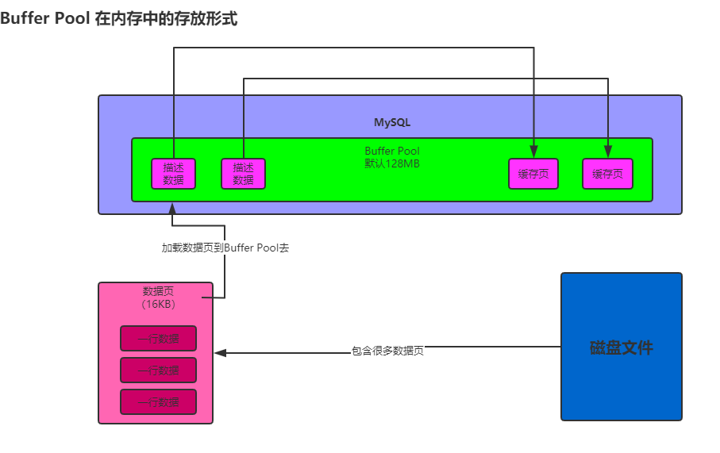

#### bufferPool在内存中到底是怎么存放的

- 概要:
    - 图例:
        - 
    - 说明:
        - 缓冲池:
            - 可以在服务器上设置缓冲池的大小。
        - 数据页：
            - mysql对数据抽象出来了一个数据页的概念，它是把很多行数据放在一个数据页中。也就是说我们的磁盘文件中就是会有很多的数据页，每一页数据里放了很多行数据。
        - 数据页和缓存页：
            - 默认情况下，磁盘中存放的数据页大小是16KB大小，也就是说一个数据包含了16KB的内容。毕竟Buffer Pool是一个缓冲池，所有的缓存页又是从磁盘上将数据页加载过来的，所以数据页和缓存页是一一对应的。
        - 描述数据：
            - 主要是对缓存页的数据进行描述，一般就是数据页所属的表空间，数据页的编号，这个缓存页在Buffer Pool中的地址以及别的信息。
- 语法:
- 案例:
