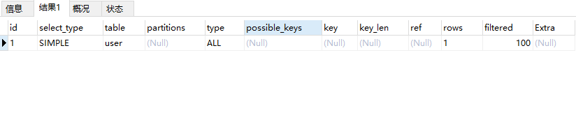
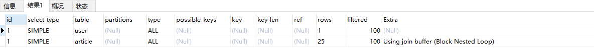
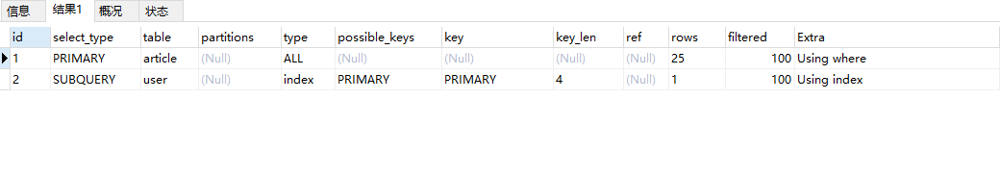

#### EXPLAIN 执行计划

##### 1. 通过 `explain` 可以获取SQL的执行计划。
- 案例：
    - 案例1：
        - 例如：`explain select * from tableName;` 可以查看到执行计划。
            - 
        - 分析：
            - id:
            - select_type:
            - table:
                - 表名
            - type:
                - all：全表扫描。
            - rows:
                - 说明全表扫描会扫描这个表的1条数据，说明这张表里面原本就有1条数据，此时你全表扫描会全部扫描出来。
            - filtered：
                - 因为没有加where条件，所以直接筛选出来的数据就是表里数据的100%占比。
    - 案例2：
        - 例如：`EXPLAIN SELECT * FROM `user` JOIN article;`
            - 
        - 说明：
            - 这个执行计划分为两条，也就是说会访问两张表。`user`明显用了全表扫描。
            - `article`表也是全表扫描，`user`表中的每条数据都会去`article`表全表扫描25条数据，跟`article`表的每一条数据都会做一个关联，而且`extra`中说了`Nested Loop`，也就是说嵌套循环的方式。
    - 案例3：
        - 例如：`EXPLAIN SELECT * FROM article WHERE user_id in ( SELECT id from `user`) or author='青衣';`
            - 
        - 说明：
            - 
