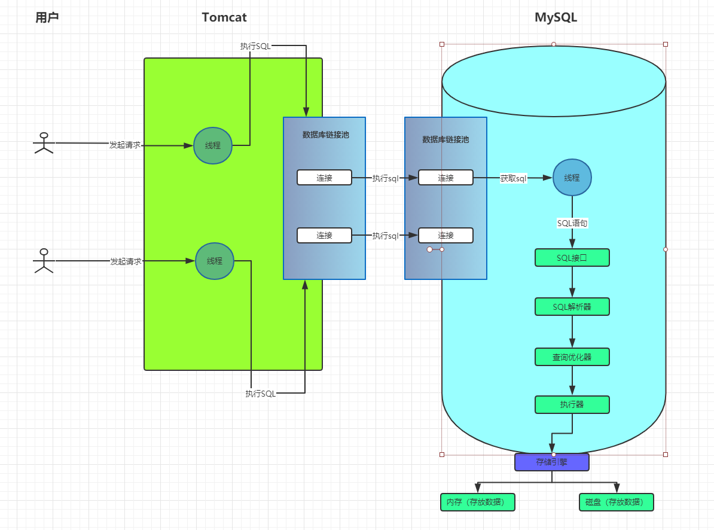

#### MYSQL的架构

- 概要：
    - mysql从用户调用到sql执行的流程介绍：
        - 
    - 说明：
        - 数据库线程：
            - 一成不变的原则：网络连接必须让`线程`来处理。
                - 当数据库连接池中监听到有连接请求，这个时候会分配一个线程来处理。
        - SQL接口：
            - 负责处理接收到的sql。
                - 线程监听到请求和读取数据之后，将SQL语句交给SQL接口执行SQL。
        - SQL解析器：
            - 解析成能让mysql看的懂的语句。
                - 案例：
                    - `select id,name,age from users where id=1;`
                - SQL解析器怎末处理SQL呢？
                    - ① 我们从 `users` 表查询数据。
                    - ② 查询 `id` 字段的值等于1的那条数据。
                    - ③ 对查询那条数据提取出里面的 `id, name, age`三个字段。
        - 查询优化器：
            - 选择一条最优路径执行查询：
                - 案例：
                    - 方式1：
                        - 直接定位到 `users` 表中的 `ID` 字段等于1的那一行数据，然后查询出来`id`的值为1的那条数据。将`id, name, age`取出来就行了。
                    - 方式2：
                        - 先把`users`表中每一行数据的`id, name, age`查询出来，然后从这批数据中过滤出`ID`为1的数据。
        - 执行器：
            - 执行器根据查询优化器生成的执行计划调用存储引擎的接口完成SQL语句。
        - 存储引擎：
            - 真正执行sql的地方，这个里面又会区分出是调用`内存中的数据`还是`磁盘上的数据`。
- 语法：
- 案例：
