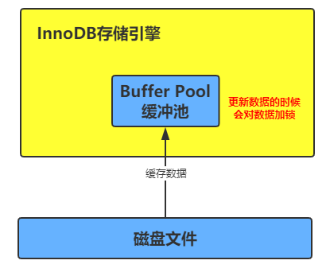
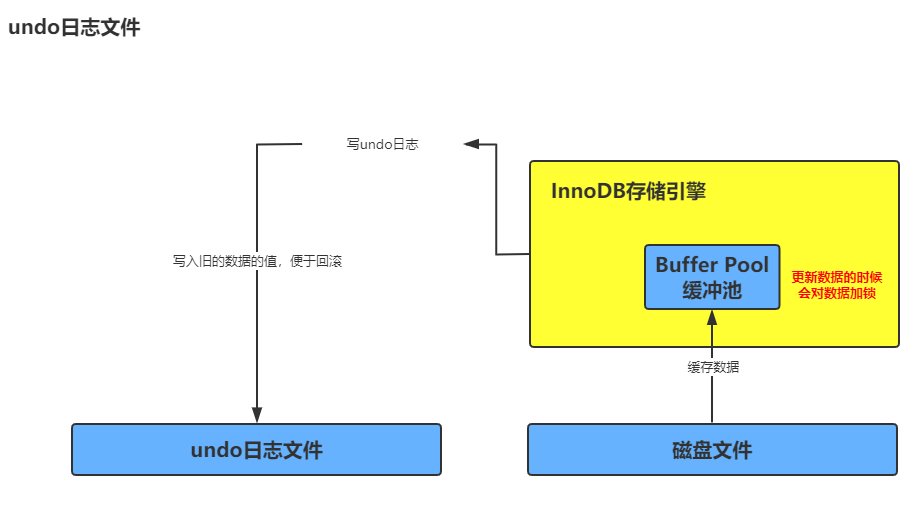
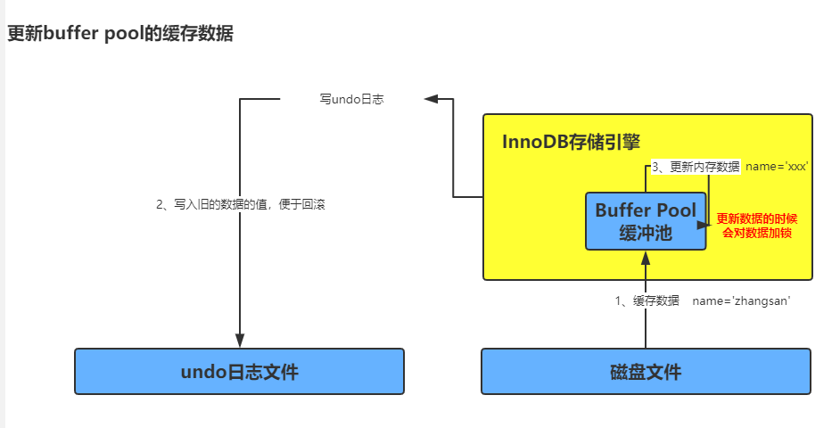
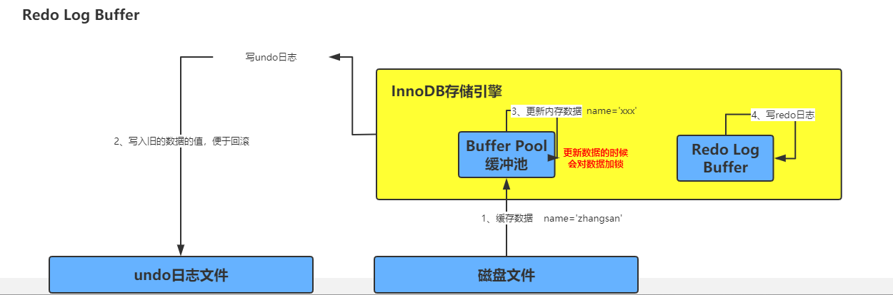

#### InnoDB存储引擎
- 概要：
    - 定义:
        - 通过一条SQL来看innodb怎么执行的？
            ```sql
                update users set name='xxx' where id=10;
            ```
    - innodb的内存结构：缓冲池：
        - 图例：
            - 
        - 说明：
            - 引擎要执行更新语句的时候，比如更新`id=10`这行数据，他先会查看数据在缓冲池中是否有这条数据，如果没有，会直接从磁盘中加载中缓冲池中，而且接着会对这行记录加独占锁。
    - undo日志文件:
        - 图例：
            - 
        - 说明：
            - 接着上面的继续，假设`id=10`这行数据的name原来是`zhangsan`，现在要更新为`xxx`，那么此时我们的先把要更新的原来的值`zhangsan`和`id=10`，写入到undo日志文件中。
    - 更新buffer pool的缓存数据：
        - 图例：
            - 
        - 说明：
            - 当数据从磁盘中加载数据到内存，然后将旧的数据写入到undo文件中之后，这个时候就会开始更新缓冲池中的数据，这个时候的数据是脏数据。因为这个时候还没有将更新后的数据持久化到磁盘上。
    - Redo Log Buffer:
        - 图例：
            - 
        - 说明：
            - 上面已经把内存中的数据更新了，还没将数据持久化到磁盘上，但是这个时候如果数据库宕机，数据就会丢失，这个时候数据又出现了`redo log buffer`内存区域，将你修改的数据存放在这个里面。比如：`name=xxx` 这个就会存在里面。如果事务没有提交的话，数据库宕机了 `redo log buffer`也会丢失。其实这个时候是没有关系的，这个时候如果重启数据库，数据其实还是没有修改之前的数据。
    - 事务提交将 redo 日志写入到磁盘中：
        - 利用 innodb_flush_log_at_trx_commit 配置策略来将redo数据持久化到硬盘上：
            - 参数是0：
                - 这个时候是不会将数据持久化到硬盘上的。
            - 参数是1：
                - 这个时候一定会将数据持久化到磁盘上，即使还没持久化到硬盘上的时候数据库宕机了，但是当数据库重启时，会根据`redo`将数据持久化到硬盘上。
            - 参数时2：
                - 这个时候会将数据存到 `os cache` 中，如果这个时候数据库宕机了。数据还是会丢失。
- 语法：
- 案例：
