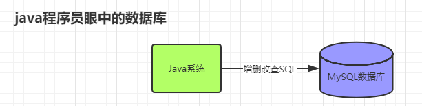
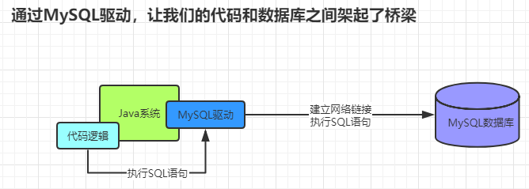
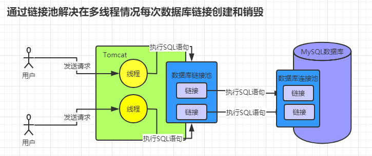

#### mysql和程序交互

- 概要：
    - Java工程师眼中的数据库？
        - 
    - 通过MySQL驱动，让我们的代码和数据库之间架起了桥梁：
        - 
    - 数据库链接池：
        - 说明：
            - 当我们将代码部署再 Tomcat 中，Tomcat肯定是以多线程的方式去执行请求的，所以不可能每次的请求链接都要重新建立然后销毁，所以出现了连接池。在实际的开发中，要有多个系统进行链接数据库，所有数据库也有链接池。
            - 下面这张图解决了问题：
                - 
- 语法：
- 案例：
