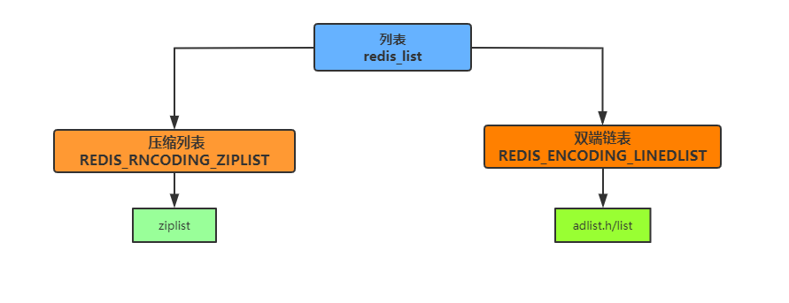
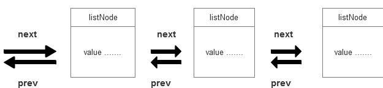
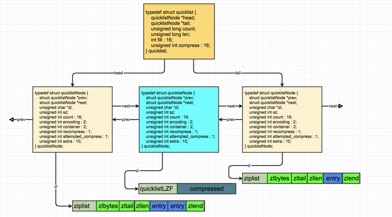

#### 链表和节点

##### 链表
- 
- 在版本3.2之前，Redis列表list使用两种数据结构作为底层实现：
    - 压缩列表
    - 双端链表
- 因为双端链表占用的内存比压缩列表要多，所以当创建新的列表键时，列表会优先考虑使用`压缩列表`,并且在需要的时候，才从压缩列表实现转换成双端链表实现。
- 什么时候由压缩列表转换成双端链表？
    - 创建新列表时redis默认使用`redis_encoding_ziplist`编码，当满足下面任意一个条件时，列表会被转换成`redis_encoding_linkedlist`编码：
        - 向列表新添加一个字符串值，且这个字符串的长度超过`server.list_max_ziplist_value`(默认64)。
        - ziplist包含的节点超过`server.list_max_ziplist_entries`(默认512)
        - 在配置文件中可以修改。

##### 3.2之前
- ziplist压缩列表？
    - 压缩列表是为了redis节约内存而开发的。
    - ziplist是一个特别的双向链表，没有维护双向指针prev next;反而是存储上一个entry的长度和当前entry长度，通过长度推算出下一个元素在什么地方。
    - 牺牲读取的性能，获得高效的存储空间，因为存储指针比存储entry长度更费内存，这就是典型的`时间换空间`。
- linkedlist双端链表
    - 
    - 每个节点使用`adlist.h/listNode`结构表示。
        ```c++
            typedel struct listNode {
                struct listNode prev; // 前置节点
                struct listNode next; // 后置节点
                void value;   // 节点的值
            }listNode;

            typedel struct list {
                listNode head; // 表头节点
                listNode tail; // 表尾节点
                unsigned long  len;   // 链表所包含的节点数量
                void (dup)(void ptr) ; // 节点复制函数
                void (free)(void ptr) ; // 节点值释放函数
                int (match ptr  void key); // 节点值对比函数
            }list
        ```
    - 多个listNode可以通过`prev`和`next`组成双端链表，虽然仅仅使用多个listNode结构可以组成链表，但使用`alist.h/list`来持有链表的话，操作数据会更方便。

##### 3.2之后
- quicklist列表对象
    - 官网定义：
        ```text
            A doubly linked list of ziplists
            A generic doubly linked quicklist implementation
        ```
        - quicklist是一个双向链表，并且是一个ziplist的双向链表，ziplist本身是一个维持数据项先后顺序的列表，而且数据项保存在一个连续的内存块种。
    - quicklist结构定义：
        ```c++
            typedef struct quicklist {
                //头结点
                quicklistNode *head; 
                //尾节点
                quicklistNode *tail; 
                //所有ziplist中entry数量
                unsigned long count; 
                //quicklistNodes节点数量
                unsigned int len;   
                //ziplist中entry能保存的数量,由list-max-ziplist-size配置项控制 
                int fill : 16;       
                //压缩深度,由list-compress-depth配置项控制
                unsigned int compress : 16; 
            } quicklist;

        ```
    - quicklistNode结构定义：
        ```c++
            typedef struct quicklistNode {
                //前节点指针
                struct quicklistNode *prev; 
                //后节点指针
                struct quicklistNode *next; 
                //数据指针。当前节点的数据没有压缩，那么它指向一个ziplist结构；否则，它指向一个quicklistLZF结构。
                unsigned char *zl;
                //zl指向的ziplist实际占用内存大小。需要注意的是：如果ziplist被压缩了，那么这个sz的值仍然是压缩前的ziplist大小
                unsigned int sz;  
                //ziplist里面包含的数据项个数
                unsigned int count : 16;   
                //ziplist是否压缩。取值：1--ziplist，2--quicklistLZF 
                unsigned int encoding : 2; 
                //存储类型，目前使用固定值2 表示使用ziplist存储
                unsigned int container : 2; 
                //当我们使用类似lindex这样的命令查看了某一项本来压缩的数据时，需要把数据暂时解压，这时就设置recompress=1做一个标记，等有机会再把数据重新压缩
                unsigned int recompress : 1;
                unsigned int attempted_compress : 1; /* node can't compress; too small */
                unsigned int extra : 10; /* more bits to steal for future usage */
            } quicklistNode;
        ```
    - quicklistLZF结构定义：
        ```c++
            typedef struct quicklistLZF {
                unsigned int sz;  //压缩后的ziplist大小
                char compressed[];//柔性数组，存放压缩后的ziplist字节数组
            } quicklistLZF;
        ```
    - quicklist结构图：
        - 

##### 总结
- 1、双向链表
    - 双端链表便于在表的两端进行`push`和`pop`操作，但是它的内存开销比较大。
    - 双端链表每个节点上除了要保存的数据之外，还要额外保存两个指针。
    - 双端链表的各个节点是单独的内存块，地址不连续，节点多了容易产生内存碎片。
- 2、压缩列表
    - ziplist由于是一块连续的内存，所以存储效率很高。
    - ziplist不利于修改操作，每次数据变动都会引发一次内存的realloc。
    - 当ziplist长度很长的时候，一次realloc可能会导致大批量的数据拷贝，进一步降低性能。
- 3、quicklist
    - 空间效率和时间效率的折中。
    - 结合了双端链表和压缩列表的优点。