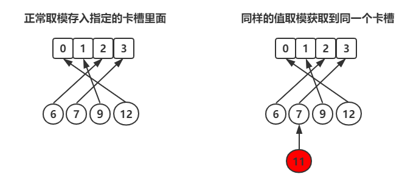

#### 字典

##### 哈希表概述
- 简单介绍几个概念：
    - 分类：
        - 哈希表（散列表）
        - 映射
        - 冲突
        - 链地址
        - 哈希函数
    - 说明：
        - 哈希表的初衷是为了将数据映射到数组中的某个位置，这样就能通过数组下标访问该数据，提高数据的查找速度，这样的查找的平均期望的时间复杂度是O(1)级别。
    - 案例：
        - 用哈希表申请一个长度为4的数组，然后将`6、7、8、9、12`4个数字通过取模的方式，放在不同的卡槽里面。这样做，最大限度的提高空间的利用率，并且查找的效率还很高(左图)。
        - 
        - 右图中多了一个`11`，这样算出来的值又会出现在3的位置上，这就是哈希冲突了，redis解决哈希冲突的方式是，链地址法，就是在7的节点上挂上11。


##### Redis数据结构
- 哈希表
    - redis字典所使用的哈希表由`dict.h/dictht`结构定义：
        ```c
            typedel struct dictht {
                dicEntry table; //哈希表数组
                unsigned long size; //哈希表的大小
                unsigned long sizemask; //哈希表大小的掩码,用于计算索引值
                unsigned long used; //该哈希表已有的节点数量
            }dictht
        ```
    - 解释：
        - table：
            - table属性式一个数组，数组中的每一个元素都指向`dict.h/dictEntry`结构指针，每个`dictEntry`结构保存着一个键值对。
        - size:
            - size属性记录了哈希表的大小，就是`table`数组的大小。
        - sizemask:
            - sizemask属性值总是等于 `size() - 1` 这个属性和哈希值一起决定一个键应该放在table数组的那个索引上。
        - used:
            - used属性记录了哈希表当前已有的节点的数量。

- 哈希表节点
    - 哈希表节点使用`dictEntry`结构表示，每个`dictEntry`结构都保存着一个键值对。
        ```c
            typedel struct dicEntry {
                void key; // 键
                struct dicEntry next; // 执向下一个哈希表节点,形成链表

                union {//值
                    void val;
                    uin64_tu64;
                    in64_tu64;
                }v

            }dicEntry
        ```
    - 解释：
        - key:
            - key 属性保存着键值对中的key。
        - value：
            -  val 属性保存着键值对中的值,值可以是一个指针,或者是一个 uin64\_tu64 整数, 或者是一个 in64\_tu64 整数。
        - next:
            - next属性指向另一个哈希节点的指针，这个指针可以将多个哈希值相同的键值对链接一次，用来解决键冲突的问题。

- 字典
    - Redis中字典结构由`dict.h/dict`表示：
        ```c
            typedel struct dict {
                dictType *type; // 典型特定函数
                void *private;  // 私有数据
                dicththtp[2];   // 哈希表
                in trehashudx;  // rehashing not in progress ifrehashidx =-1  当rehash不在进时,值为 -1
            }dict
        ```
    - 解释：
        - type:
            - type 是一个指向 dict.h/dictType 结构的指针，保存了一系列用于操作特定类型键值对的函数。

        - privdata：
            - privdata 保存了需要传给上述特定函数的可选参数。

        - dicththtp：
            - dicththtp是两个哈希表，一般情况下，只使用ht[0]，只有当哈希表的键值对数量超过负载(元素过多)时，才会将键值对迁移到ht[1]，这一步迁移被称为 rehash (重哈希)，rehash 会在下文进行详细介绍。
        - rehashidx：
            - rehashidx 由于哈希表键值对有可能很多很多，所以 rehash 不是瞬间完成的，需要按部就班，那么 rehashidx 就记录了当前 rehash 的进度，当 rehash 完毕后，将 rehashidx 置为-1。

- 类型处理函数：
    - 类型处理函数都在`dict.h/dictType`中：
        ```c
            typedef struct dictType {
                unsigned int (*hashFunction)(const void *key);                                         // 计算哈希值的函数
                void *(*keyDup)(void *privdata, const void *key);                                      // 复制键的函数
                void *(*valDup)(void *privdata, const void *obj);                                      // 复制值的函数
                int (*keyCompare)(void *privdata, const void *key1, const void *key2);                 // 比较键的函数
                void (*keyDestructor)(void *privdata, void *key);                                      // 销毁键的函数
                void (*valDestructor)(void *privdata, void *obj);                                      // 销毁值的函数
            } dictType;

        ```

##### 哈希函数
- 定义：
    - 类型处理函数中的第一个函数`hashFunction`就是计算某个键的哈希值的函数，对于不同类型的key,哈希值得计算是不同的，所以在字典进行创建的时候，需要指定哈希函数。
- Redis源码中提供的一些哈希函数的实现：
    - 整数哈希：
        ```c
            unsigned int dictIntHashFunction(unsigned int key)
            {
                key += ~(key << 15);
                key ^=  (key >> 10);
                key +=  (key << 3);
                key ^=  (key >> 6);
                key += ~(key << 11);
                key ^=  (key >> 16);
                return key;
            }
        ```
    - 字符串哈希：
        ```c
            unsigned int dictGenCaseHashFunction(const unsigned char *buf, int len) {
                unsigned int hash = (unsigned int)dict_hash_function_seed;
                while (len--)
                    hash = ((hash << 5) + hash) + (tolower(*buf++)); /* hash * 33 + c */
                return hash;
            }
        ```

##### 哈希算法
- 索引：
    - 当插入或者获取数据的时候，都会根据key获取值，在获取或者插入的过程中需要将key进行hash:
        - 通过宏`dicHashKey`计算得到该键对应的哈希值
            ```c
                #define dictHashKey(d, key) (d)->type->hashFunction(key)
            ```
        - 将哈希值和哈希表的`sizemask`属性做位于，得到索引值index,其中ht[x]可以是ht[0]或者ht[1]
            ```c
                index = dictHashKey(d, key) & d->ht[x].sizemask;
            ```
- 冲突解决：
    - 插入数据的时候会出现`hash`冲突，API是`dict.c/dictAddRaw`:
        ```c
            dictEntry *dictAddRaw(dict *d, void *key)
            {
                int index;
                dictEntry *entry;
                dictht *ht;
                if (dictIsRehashing(d)) _dictRehashStep(d);               // 1、执行rehash
                if ((index = _dictKeyIndex(d, key)) == -1)                // 2、索引定位
                    return NULL;
                ht = dictIsRehashing(d) ? &d->ht[1] : &d->ht[0];          // 3、根据是否 rehash ，选择哈希表
                entry = zmalloc(sizeof(*entry));                          // 4、分配内存空间，执行插入
                entry->next = ht->table[index];
                ht->table[index] = entry;
                ht->used++;
                dictSetKey(d, entry, key);                                // 5、设置键
                return entry;
            }
        ```
    - 1、判断当前的字典是否`rehash`，如果是，则执行一步`rehash`,否则忽略。判断`rehash`的依据就是`rehashidx`是否为-1。
    - 2、通过`_dictKeyIndex`找到一个索引，如果返回-1表明字典中已经存在相同的key。
    - 3、根据是否在`rehash`选择对应的哈希表。
    - 4、分配哈希表节点 dictEntry 的内存空间，执行插入，插入操作始终在链表头插入，这样可以保证每次的插入操作的时间复杂度一定是 O(1) 的，插入完毕，used属性自增。
    - 5、dictSetKey 是个宏，调用字典处理函数中的 keyDup 函数进行键的复制。
- 索引定位：
    - 插入数据时需要进行索引定位，以确定节点插入到哈希表中的哪个位置，方法在`dict.c/_dictKeyIndex`:
        ```c
            static int _dictKeyIndex(dict *d, const void *key)
                {
                    unsigned int h, idx, table;
                    dictEntry *he;
                
                    if (_dictExpandIfNeeded(d) == DICT_ERR)                            // 1、rehash 判断
                        return -1;
                    h = dictHashKey(d, key);                                           // 2、哈希函数计算哈希值
                    for (table = 0; table <= 1; table++) {
                        idx = h & d->ht[table].sizemask;                               // 3、哈希算法计算索引值
                        he = d->ht[table].table[idx];
                        while(he) {                          
                            if (key==he->key || dictCompareKeys(d, key, he->key))      // 4、查找键是否已经存在
                                return -1;
                            he = he->next;
                        }
                        if (!dictIsRehashing(d)) break;                                // 5、rehash 判断 
                    }
                    return idx;
                }
        ```
    - 1、判断当前哈希表是否需要进行扩展，具体参见接下来要讲的 rehash。
    - 2、利用给定的哈希函数计算键的哈希值。
    - 3、通过位与计算索引，即插入到哈希表的哪个槽位中。
    - 4、查找当前槽位中的链表里是否已经存在该键，如果存在直接返回 -1；这里的 dictCompareKeys 也是一个宏，用到了keyCompare 这个比较键的函数。
    - 5、这个判断比较关键，如果当前没有在做 rehash，那么 ht[1] 必然是一个空表，所以不能遍历 ht[1]，需要及时跳出循环。

##### rehash
- TODO:

##### 渐进式rehash
- TODO:

## 说明：
- `转载至CSDN：英雄哪里出来`