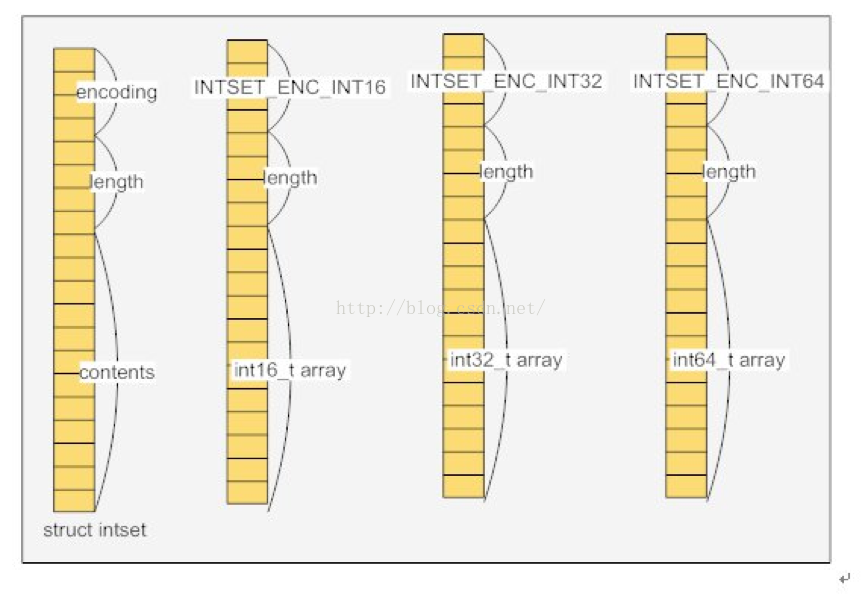

#### intset和hashtable

##### set底层存储
- redis中的集合（set）底层的数据结构是：`intset和hashtable`两种数据结构存储的。`intset`和数组差不多，`hashtable`是普通的哈希表，key为set的值，value为null。
- 使用`intset`的条件是下面两个条件，反之就是用的`hashtable`:
    - 集合对象保存所有的元素都是整数值。
    - 集合对象的元素的数量不超过512个。

##### intset的数据结构
- intset内部其实是一个数组（int8_t coentents[]数组），而且存储数据的时候是有序的，因为在查找数据的时候是通过二分查找来实现的。
```c
    typedef struct intset {
        uint32_t encoding; //编码方式
        uint32_t length;   //集合包含的元素数量
        int8_t contents[]; //保存元素的数组
    } intset;
```
- 

##### set存储过程
- 这个需要从新找书籍添加