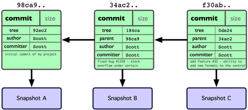

# 分支

1.1 概述  
1.2 新建和合并  
1.3 管理分支  
1.4 远程分支  
1.5 分支的扩展

## 1.1 概述

在 `Git` 中提交时，会保存一个 `commit` 对象，该对象包含一个指向暂存内容快照的指针，包含本次提交的作者等相关的附属信息，包含零个或者多个指向该提交对象的父对象指针；首次提交时没有直接祖先的，普通提交有一个祖先，由两个或者多个分支合并产生的提交则有多个祖先。

### 1.1.1 示例

在工作目录中有三个文件，准备将他们暂存后提交。暂存操作会对每一个文件计算校验和\(SHA-1哈希串\)，然后把当前版本的文件快照保存在 `Git` 仓库中\(Git使用blob类型的对象存储这些快照\)， 并将校验和加入暂存区域。 当使用 `git commit` 新建一个提交对象前，Git 会先计算每一个子目录的校验和吗，然后在 `Git` 仓库中将这些目录保存为树\(对象\)；之后 `Git` 创建的提交对象，除了包含提交信息外，还包含了指向整个树对象的指针。这样将来需要的时候，重现此次快照的内容了。

```text
    $ git add text1.md text2.md tesxt3.md
    $ git commit -m "init desc"
```

现在仓库中有了五个对象：三个文件表示快照内容 `blob` 对象；一个记录这目录树内容和其中各个文件对应 `blob` 对象索引的 `tree` 对象；还有就是一个包含指向 `tree` 对象的索引和其他提交信息源数据的 `commit` 对象。


修改后再次提交，这次提交的对象会包含上一个指向上次提交对象的指针。两次提交后变成下面这样。



`Git` 中的分支，其实本质上仅仅是个指向 `commit` 对象的可变指针。`Git` 会将 `master` 作为分支的默认名字。若干次提交以后，其实已经有一个指向最后一次提交对象的 `master` 分支，他在每次提交的时候都会向前移动。


### 1.1.2 创建分支

使用命令 `git branch` 创建分支

```text
    $ git branch testing
```


`Git` 保存着一个名为 `HEAD` 的特别的指针。在 Git 中他是一个指向你正在工作中的本地分支的指针。运行 `git branch` 命令，仅仅是建立了一个新的分支，但是不会自动切换到这个新建的分支中。


### 1.1.3 切换分支

使用命令 `git checkout` 切换分支：

```text
    $ git checkout testing
```


## 1.2 新建和合并

使用命令创建并切换分支

```text
    $ git checkout -b <分支名称>
```

合并分支,将开发分支合并到 `master` 主分支中

```text
    $ git checkout master
    $ git merge <开发分支>
```

删除分支

```text
    $ git branch -d <分支名称>
```

解决冲突, `=======` 隔开的上半部分，是 `HEAD`\(即 `master` 分支，在运行 `merge` 命令时所切换到的分支\)中的内容。下半部分是在开发分支的内容。

```text
    <<<<<<< HEAD:index.html
    <div id="footer">contact : email.support@github.com</div>
    =======
    <div id="footer">
    please contact us at support@github.com
    </div>
    >>>>>>> iss53:index.html
```

## 1.3 管理分支

列出所有的分支

```text
    $ git branch
```

列出各个分支最后一个提交对象的信息

```text
    $ git branch -v
```

## 1.4 远程分支

远程分支是对远程仓库中分支的索引。通过 `git fetch origin` 来同步远程服务器上的数据到本地。

推送本地的开发分支到远程

```text
    $ git push origin <开发分支名>
```

删除远程分支

```text
    $ git push origin :<开发分支名>
```

## 1.5 分支的扩展

`git rebase ing`

