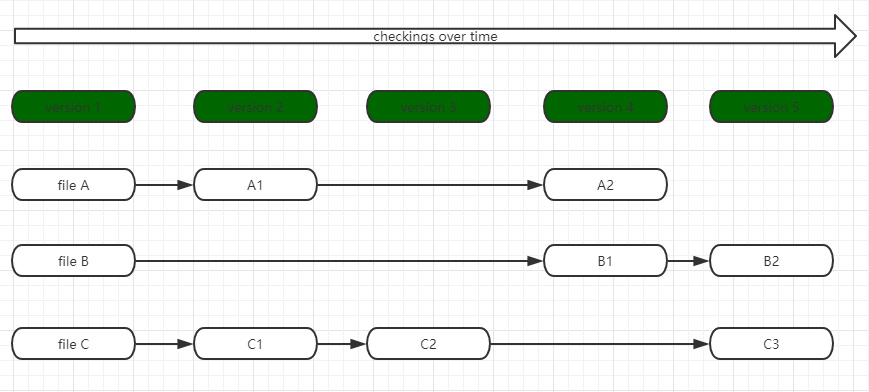
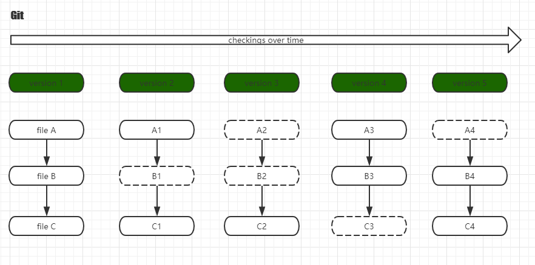

# 介绍

1.1 版本控制  
1.2 历史  
1.3 基础  
1.4 安装  
1.5 配置

## 1.1 版本控制

### 1.1.1 概述：

版本控制是指对软件开发过程中各种程序代码、配置文件及说明文档等文件变更的管理，是软件配置管理的核心思想之一。

### 1.1.2 简述：

版本控制最主要的功能就是追踪文件的变更。它将什么时候、什么人更改了文件的什么内容等信息忠实地了记录下来。每一次文件的改变，文件的版本号都将增加。除了记录版本变更外，版本控制的另一个重要功能是并行开发。软件开发往往是多人协同作业，版本控制可以有效地解决版本的同步以及不同开发者之间的开发通信问题，提高协同开发的效率。并行开发中最常见的不同版本软件的错误\(Bug\)修正问题也可以通过版本控制中分支与合并的方法有效地解决。

### 1.1.3 控制系统进化问题以及解决方式：

> 本地式版本控制系统:
>
> > 在一台服务器根据目录的时间进行备份。
> >
> > > 好处：
> > >
> > > > 简单
> > >
> > > 坏处：
> > >
> > > > 一旦操作出错，所有的文件将全部丢失。
> > >
> > > 问题：
> > >
> > > > 不能让在不同系统中的开发者协同工作。
>
> 集中式版本控制系统
>
> > 将所有的文件放在一台服务器上进行管理。
> >
> > > 好处：
> > >
> > > > 可以看到项目中其他人的工作进度。管理员可以掌握开发者的权限。
> > >
> > > 坏处：
> > >
> > > > 服务器宕机，所有人对文件都不能操作，如果服务器发生故障，容易造成数据的丢失。
> > >
> > > 问题：
> > >
> > > > 核心服务器宕机，所有工作人员不能进行文件的操作。
>
> 分布式版本控制系统:
>
> > 分布式版本控制系统有：Git，Mercurial，Bazaar 以及 Darcs 等，客户端并不是提取最新版本的文件快照，而是把代码仓库完整的镜像下来。这样，任何一处协同工作用的服务器发生故障，事后都可以用任何一个镜像出来本地仓库进行恢复。因为每一次的提取操作，都是一次对代码的完整备份。

## 1.2 历史

| 版本 | 最初发布日期 | 最新修订版本 | 最新修订版本发布日期 |
| :--- | :--- | :--- | :--- |
| 0.99 | 2005-07-11 | 0.99.9n | 2015-12-15 |
| 1.0 | 2005-12-21 | 1.0.13 | 2006-01-27 |
| 1.1 | 2006-01-08 | 1.1.6 | 2006-01-30 |
| 1.2 | 2006-02-12 | 1.2.6 | 2006-04-08 |
| 1.3 | 2006-04-18 | 1.3.3 | 2006-05-16 |
| 1.4 | 2006-06-10 | 1.4.4.5 | 2008-07-16 |
| 1.5 | 2007-02-14 | 1.5.6.6 | 2008-12-17 |
| 1.6 | 2008-08-17 | 1.6.6.3 | 2010-12-15 |
| 1.7 | 2010-02-13 | 1.7.12.4 | 2012-10-17 |
| 1.8 | 2012-10-21 | 1.8.5.6 | 2014-12-17 |
| 1.9 | 2014-02-14 | 1.9.5 | 2014-12-17 |
| 2.0 | 2014-05-28 | 2.0.5 | 2014-12-17 |
| 2.1 | 2014-08-16 | 2.1.4 | 2014-12-17 |
| 2.2 | 2014-11-26 | 2.2.3 | 2015-09-04 |
| 2.3 | 2015-02-05 | 2.3.10 | 2015-09-29 |
| 2.4 | 2015-04-30 | 2.4.12 | 2017-05-05 |
| 2.5 | 2015-07-27 | 2.5.6 | 2017-05-05 |
| 2.6 | 2015-09-28 | 2.6.7 | 2017-05-05 |
| 2.7 | 2015-10-04 | 2.7.6 | 2017-07-30 |
| 2.8 | 2016-03-28 | 2.8.6 | 2017-07-30 |
| 2.9 | 2016-06-13 | 2.9.5 | 2017-07-30 |
| 2.10 | 2016-09-02 | 2.10.5 | 2017-09-22 |
| 2.11 | 2016-11-29 | 2.11.4 | 2017-09-22 |
| 2.12 | 2017-02-24 | 2.12.5 | 2017-09-22 |
| 2.13 | 2017-05-10 | 2.13.7 | 2018-05-22 |
| 2.14 | 2017-08-04 | 2.14.5 | 2018-09-27 |
| 2.15 | 2017-10-30 | 2.15.3 | 2018-09-27 |
| 2.16 | 2018-01-17 | 2.16.5 | 2018-09-27 |
| 2.17 | 2018-04-02 | 2.17.2 | 2018-09-27 |
| 2.18 | 2018-06-21 | 2.18.1 | 2018-09-27 |
| 2.19 | 2018-09-10 | 2.19.2 | 2018-11-21 |
| 2.20 | 2018-12-09 | 2.20.1 | 2018-12-15 |
| 2.21 | 2019-02-24 | 2.21.0 | 2019-02-24 |
| 2.22 | 2019-06-07 | 2.22.0 | 2019-06-07 |
| 2.23 | 2019-08-16 | 2.23.1 | 2019-12-07 |
| 2.24 | 2019-11-04 | 2.24.1 | 2019-12-07 |
| 2.25 | 2020-01-13 | 2.25.1 | 2020-02-17 |

## 1.3 基础

### 1.3.1 直接记录快照，并非差异比较

Git 和其他控制系统相比，Git 只关心文件数据的整体是否发生了变化，而大多数其他系统则关心文件的内容的具体差异。

* 图 1.3 other

  

Git 不保存这些前后变化的差异数据。Git 更像是把变化的文件作快照后，记录在一个微型文件系统中。每次提交更新时，他会纵览一遍所有文件的指纹信息并对文件作一个快照，然后保存一个指向快照的索引。为了提高性能，如果文件没有变化，Git不会保存，而是对上次保存到快照做一个链接。

* 图 1.4 other

  

### 1.3.2 近乎所有的操作都是本地执行

Git 大多数的操作都是在本地进行，不用联网。如果是用cvcs\(集中式管理系统\)，基本上所有的操作都是需要联网的，因为 Git 在本地磁盘上就保存了所有当前项目的历史更新记录，所以处理起来速度比较快。

### 1.3.3 时刻保持数据完整性

在保存到 Git 之前，所有的数据都要进行内容的校验和计算，并将结果作为数据的唯一标识和索引。不可能在你修改了文件或者目录之后，Git 一无所知，这个特性作为 Git 的设计哲学，建立在整体架构的最底层。所以如果文件在传输变得不完整或者磁盘损坏导致文件数据缺失， Git 能够立即察觉。通过sha1算法进行目录和文件的加密，所以在 Git 中经常看到 24b9da6552252987aa493b52f8696cd6d3b00373 数据。

### 1.3.4 多数据操作仅添加数据

常见的 Git 操作仅仅把数据添加到数据库中，因为任何一种不可逆操作，比如删除数据，都会使回退或者重现历史版本变得困难重重。在 Git 中一旦提交快照完全不需要担心数据丢失。

### 1.3.5 文件的状态转化

Untracked

* 未跟踪, 此文件在文件夹中, 但并没有加入到git库, 不参与版本控制. 通过git add 状态变为Staged。

Unmodify

* 文件已经入库, 未修改, 即版本库中的文件快照内容与文件夹中完全一致. 这种类型的文件有两种去处, 如果它被修改, 而变为Modified. 如果使用git rm移出版本库, 则成为Untracked文件。

Modified

* 文件已修改, 仅仅是修改, 并没有进行其他的操作. 这个文件也有两个去处, 通过git add可进入暂存staged状态, 使用git checkout 则丢弃修改过, 返回到unmodify状态, 这个git checkout即从库中取出文件, 覆盖当前修改。

Staged

* 暂存状态. 执行git commit则将修改同步到库中, 这时库中的文件和本地文件又变为一致, 文件为Unmodify状态. 执行git reset HEAD filename取消暂存, 文件状态为Modified。


## 1.4 安装

### 1.4.1 源码安装

```text
        # 安装依赖
        $ yum install curl-devel expat-devel gettext-devel \
    openssl-devel zlib-devel

        $ apt-get install libcurl4-gnutls-dev libexpat1-dev gettext \
        libz-dev libssl-dev

        # 获取最新的源码
        http://git-scm.com/download

        # 编译安装
        $ tar -zxf git-1.7.2.2.tar.gz
        $ cd git-1.7.2.2
        $ make prefix=/usr/local all
        $ sudo make prefix=/usr/local install

        # 下载项目
        git clone <url>
```

### 1.4.2 linux安装

```text
        $ yum install git-core

        $ apt-get install git
```

### 1.4.3 mac安装

```text
        # 笨蛋方式安装
        http://code.google.com/p/git-osx-installer
```

## 1.5 配置

### 1.5.1 初始化配置信息

```text
        # 全局添加用户名和邮箱
        $ git config --global user.name "用户名"
        $ git config --global user.email "邮箱"

        # 根据项目添加
        $ git config  user.name "用户名"
        $ git config  user.email "邮箱"

        # 查看配置信息
        $ git config  --list
```